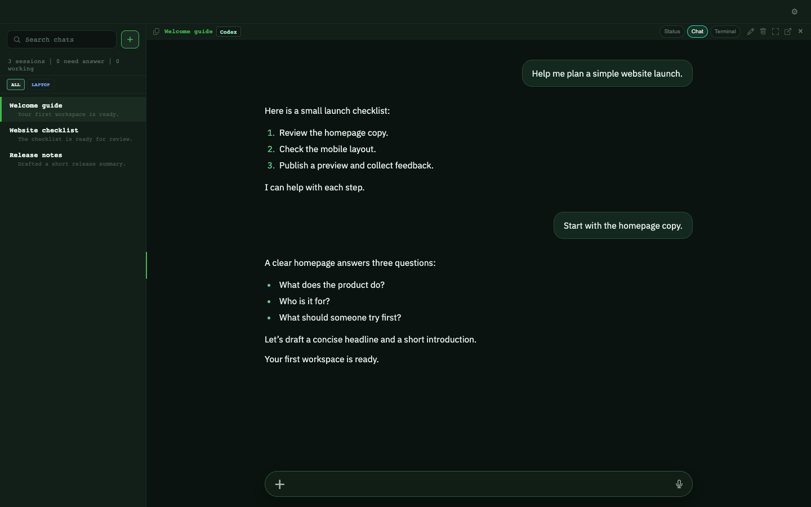

# Pentacle

Pentacle is a terminal workspace for coding agents, work specifications and review evidence. **Pentacle Web is the recommended way to install and use Pentacle**: a browser (or installed PWA) served by the Node web host (`node server`) on the computer running your agents, so the app ships once on that host and every device just reloads. This repository includes that web host, the Python daemon that runs your agent sessions, and a deprecated Electron desktop app. [Pentacle Mobile](https://github.com/HJK6/pentacle-mobile) connects to the same daemon from your phone.

> **The Electron desktop app is deprecated** — no further upgrades, packaging or rollout, and it is not recommended for new installs. Use Pentacle Web for daily work; run the daemon and open the served URL in a browser. The desktop source remains available; see [Desktop (deprecated)](#desktop-deprecated) and [web host setup](server/README.md).

The renderer's structured **Chat view is experimental and disabled by default**. Use terminal view for normal work. Mobile is a separate client and is unaffected by this setting.

## See the workspace

A single-machine example with invented sessions and conversation text. Machine
icons hide automatically when the workspace has one host.



[New Chat and terminal screenshots](docs/screenshots.md) show the other views.
Agents also publish reviewable reports and assets — see the
[reports and assets showcase](docs/reports_showcase.md).

## Getting started

The easiest setup is to start a coding agent such as Fable or Astra and give it
[AGENT_SETUP.md](AGENT_SETUP.md). That separate guide contains the agent's full
setup checklist. Have your provider account ready; login or device approvals
may need your attention. The manual steps are below: install, start the daemon,
then serve and open Pentacle Web.

For a phone, see [Pentacle Mobile](https://github.com/HJK6/pentacle-mobile).

To connect a ChatGPT "Dot" agent to your own fleet for large assignments, see
[Connect a ChatGPT Dot agent](docs/connect-a-dot-agent.md).
For an external assistant using a host-provisioned message service, see
[Connect a friend agent](docs/connect-a-friend-agent.md).

## Which repositories do I need?

| Repository | What it provides | Do I need to clone it? |
| --- | --- | --- |
| [pentacle](https://github.com/HJK6/pentacle) | Web client + daemon (and the deprecated Electron desktop app) | Yes, on the computer running your agents. The daemon serves the web client; the desktop app is deprecated. |
| [pentacle-mobile](https://github.com/HJK6/pentacle-mobile) | Mobile app | Only if you want to build the phone app. |
| [pentacle-chat-core](https://github.com/HJK6/pentacle-chat-core) | Shared chat model and rendering library | No. Both clients already vendor a copy in `pentacle-chat-core/`; normal dependency installation uses it automatically. Clone upstream only to work on the library itself. |

## Local setup

See the [configuration reference](docs/desktop_config.md) for host defaults, optional mic/limits setup, warnings and upgrade behavior; the web host loads the same config.

Use macOS or Linux with Node.js 22.12 or newer, Python 3.11 or newer, tmux and at least one configured agent CLI (`claude` or `codex`). Authenticate the CLI with your own account before using it through Pentacle. On Windows, run the daemon and tmux inside WSL and set `localWsl` in the config so local terminals attach through `wsl.exe`, or configure a separate SSH terminal host; the shell commands below target macOS/Linux (or a WSL shell).

From this repository:

```sh
npm ci
python3 -m venv .venv
. .venv/bin/activate
python -m pip install -r services/chat-stream-v2/requirements.txt -e services/agent-orch
mkdir -p "$HOME/.config/pentacle" "$HOME/workspace"
chmod 700 "$HOME/.config/pentacle"
cp pentacle.config.example.js "$HOME/.config/pentacle/pentacle.config.js"
```

Issue the web host's daemon credential without printing it to your terminal (the path matches `chatStream.tokenPath` in the example config):

```sh
python services/chat-stream-v2/tools/operator_auth_cli.py issue --client-kind pentacle --label web |
  python -c 'import json,os,pathlib,sys; p=pathlib.Path.home()/".config/pentacle/desktop.token"; fd=os.open(p,os.O_WRONLY|os.O_CREAT|os.O_TRUNC,0o600); os.write(fd,json.load(sys.stdin)["code"].encode()); os.close(fd); p.chmod(0o600)'
```

Start the daemon in one terminal. The `local` identity matches the example config; the provider binaries come from your PATH, and transcripts remain in the provider's native directories.

```sh
python services/chat-stream-v2/main.py --host 127.0.0.1 --port 7791 \
  --local-host local --db "$HOME/.config/pentacle/sessions.db" \
  --claude-bin "$(command -v claude)" --codex-bin "$(command -v codex)" \
  --spawn-cwd "$HOME/workspace" --projects-root "$HOME/.claude/projects"
```

An absent provider resolves to an empty binary and cannot be launched; use the provider you installed. Choose a different port in both the daemon command and private config if 7791 is already in use. In another terminal, from the repository:

Build Pentacle Web, then serve it. Open the printed `http://127.0.0.1:7795` in a browser (and, if you like, install it as a PWA). To reach it from other devices, put it behind `tailscale serve` with Tailscale identity — see [web host setup](server/README.md) for `--auth`, `--origin`, `--allow-login` and the security boundary.

```sh
npm run build:web
PENTACLE_CONFIG="$HOME/.config/pentacle/pentacle.config.js" node server --port 7795
```

Use **New Chat**, select `local`, then the provider/model. The picker uses the
catalog's `available_models` projection, while the daemon retains its broader
compatibility catalog for existing sessions and explicit handoffs. Sessions
open in terminal view. A disconnected daemon produces an error and creates no
synthetic session. Keep the daemon running while using the web client or mobile.
On the first landed operator turn, a visible top-level session receives a
provisional durable title and status card; the provider may replace that
summary, and later status changes publish to Web immediately.

To try the unfinished structured view, enable **Chat UI (experimental)** in Settings and reload, or set `features.chatUi: true` in your private config. Fresh installs default to `false`; an existing saved opt-in is preserved. Keep it off for normal use.

The private config selects `chatStream.url`, `chatStream.tokenPath`, host labels, terminal transports and optional features. The token must be a regular mode-0600 file inside a mode-0700 directory, using a path without symbolic-link ancestors. Do not commit credentials or runtime databases. See [daemon setup and remote clients](services/chat-stream-v2/README.md) and [public support boundaries](docs/public_release.md).

### Desktop (deprecated)

The Electron desktop app still starts from the same config, but it receives no upgrades and is not recommended for new users. Use Pentacle Web instead unless you already depend on the desktop app:

```sh
PENTACLE_CONFIG="$HOME/.config/pentacle/pentacle.config.js" npm start
```

## Build and test

```sh
npm run prestart                          # all renderer bundles
npm test                                  # desktop unit/renderer tests
python -m pytest services/chat-stream-v2/tests
python -m pytest services/agent-orch/tests
python tools/public_desktop_smoke.py       # real Electron + isolated daemon/provider
```

The daemon tests exercise both Bash and Zsh remote shells; install both before running them (`sudo apt-get install bash zsh` on Debian/Ubuntu). The desktop smoke requires an available graphical desktop, tmux and lsof. It uses an isolated tmux socket, temporary credentials and deterministic provider JSONL; it never launches your paid provider CLI. The default Python suite excludes the explicitly marked long-running soak tier. Tests needing real provider CLIs are opt-in with `PENTACLE_LIVE_TESTS=1`.

The certified daemon runner is `python services/chat-stream-v2/tools/run_gate.py merge` from a clean Git checkout. It runs unit and socket smoke tiers and writes evidence outside the repository. On macOS its multi-bind preflight requires the documented [loopback alias](services/chat-stream-v2/deploy/loopback-alias/README.md). CI runs these same public checks.

## Work process

Start with [PROCESS.md](PROCESS.md), [workspace setup](process/README.md) and [AGENTS.md](AGENTS.md). The included process supplies spec templates, lifecycle directories, validation and search tools, development and QA guidelines, and optional daemon-backed agent coordination. Copy the process workspace to a private directory before adding real work or receipts.

## Contributions

PRs, feature requests, and bug reports are welcome — open an issue or pull
request at <https://github.com/HJK6/pentacle/issues>.
