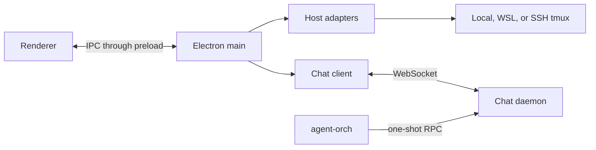

# Pentacle desktop architecture

Pentacle is an Electron desktop with terminal slots and an optional structured-chat view. The main process, renderer, preload bridge, host adapters, and chat daemon are separate boundaries so each can be tested in isolation.

## Process boundaries

| Process or module | Responsibility |
|---|---|
| Electron main | configuration, child processes, IPC handlers, and websocket client |
| Renderer | terminal grid, sidebar, structured chat, and dashboards |
| Preload | restricted `window.cc` bridge between renderer and main |
| Host adapters | local, WSL, and optional SSH terminal attachment |
| Chat daemon | session inventory, send/close operations, transcript events, notifications, and persistence |
| `agent-orch` | one-shot client for daemon RPCs |

`agent-orch` is a command-line client, not a background service. The daemon and client may both run entirely on one development machine.

## Independent topology axes

Terminal attachment is selected by the desktop configuration. With no `remote` block, the local adapter owns the tmux connection. A `localWsl` block selects WSL on Windows; a `remote` block selects the SSH adapter. Peer entries add optional terminal hosts without changing the chat connection.

Structured chat uses the websocket URL in `chatStream.url`. Keeping these choices independent means a local terminal can use a daemon on the same machine, while a test client can attach terminals through a different adapter.

## Request flows

### Structured chat

1. The renderer invokes a chat IPC method.
2. The main process validates the request and sends it over the websocket.
3. The daemon performs the session operation and returns a typed result.
4. Transcript and state changes arrive as broadcasts and are reduced by the renderer store.

### Raw terminal

1. The renderer requests a new terminal slot.
2. The main process selects a host adapter.
3. The adapter creates or attaches to a tmux session through its configured transport.

The raw terminal path does not depend on the structured-chat RPCs.

## Local persistence

Development instances should use disposable stores under an explicitly chosen directory, such as `/tmp/pentacle-example`. A daemon may keep session, notification, asset, and blob stores separate. Do not commit local stores or credentials.

The default development websocket bind is `127.0.0.1:7791`; an optional microphone service may use `127.0.0.1:7780`. Bind beyond loopback only when the deployment environment supplies its own access control.

## Configuration ownership

- The README owns desktop configuration precedence and feature flags.
- `pentacle_setup.md` owns host adapter selection and daemon ownership.
- `agent_orchestration_setup.md` owns the machines-file schema and local CLI setup.
- `chat_protocol.md` owns the wire contract.
- The daemon and CLI READMEs own their implementation-specific commands.

This document intentionally describes interfaces and responsibilities, not a particular fleet, remote service, deployment system, or credential store.
