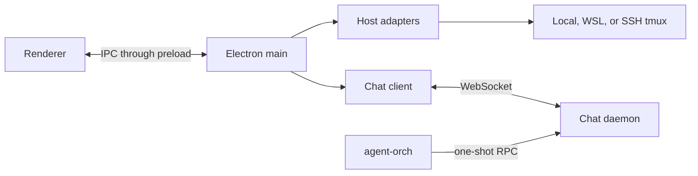

# Pentacle desktop architecture

Pentacle is an Electron desktop with terminal slots and an optional structured-chat view. The main process, renderer, preload bridge, host adapters, and chat daemon are separate boundaries so each can be tested in isolation.

## Process boundaries

| Process or module | Responsibility |
|---|---|
| Electron main | configuration, child processes, IPC handlers, and websocket client |
| Renderer | terminal grid, sidebar, structured chat, and dashboards |
| Preload | restricted `window.cc` bridge between renderer and main |
| Host adapters | local, WSL, and optional SSH terminal attachment |
| Chat daemon | session inventory, send/close operations, transcript events, notifications, and persistence |
| `agent-orch` | one-shot client for daemon RPCs |
| Web host (`server/`) | the Electron main process's job without Electron — see § Web mode |

`agent-orch` is a command-line client, not a background service. The daemon and client may both run entirely on one development machine.

## Independent topology axes

Terminal attachment is selected by the desktop configuration. With no `remote` block, the local adapter owns the tmux connection. A `localWsl` block selects WSL on Windows; a `remote` block selects the SSH adapter. Peer entries add optional terminal hosts without changing the chat connection.

Structured chat uses the websocket URL in `chatStream.url`. Keeping these choices independent means a local terminal can use a daemon on the same machine, while a test client can attach terminals through a different adapter.

## Request flows

### Structured chat

1. The renderer invokes a chat IPC method.
2. The main process validates the request and sends it over the websocket.
3. The daemon performs the session operation and returns a typed result.
4. Transcript and state changes arrive as broadcasts and are reduced by the renderer store.

### Raw terminal

1. The renderer requests a new terminal slot.
2. The main process selects a host adapter.
3. The adapter creates or attaches to a tmux session through its configured transport.

The raw terminal path does not depend on the structured-chat RPCs.

## Local persistence

Development instances should use disposable stores under an explicitly chosen directory, such as `/tmp/pentacle-example`. A daemon may keep session, notification, asset, and blob stores separate. Do not commit local stores or credentials.

The default development websocket bind is `127.0.0.1:7791`; an optional microphone service may use `127.0.0.1:7780`; the web host (below) defaults to `127.0.0.1:7795`. Bind beyond loopback only when the deployment environment supplies its own access control.

## Web mode (headless host)

The same renderer runs in a browser. `npm run web` builds an esbuild bundle of
`renderer/` and starts `server/`, a Node process that does what the Electron
main process does — owns the terminal attachments and the single chat-stream
connection — and exposes them to a page instead of to a BrowserWindow. The
Electron `file://` load path is untouched and `renderer/app.js` is not forked.

| Concern | Electron | Web |
|---|---|---|
| `window.cc` surface | `preload.js` over `ipcRenderer` | `renderer/web_cc.js` over a websocket |
| handler definitions | `main/cc_handlers.js`, registered on `ipcMain` | the same module, collected into a table |
| terminal attachment | `main/terminal_adapter.js` | the same module |
| config | the preload reads it from disk | the host injects the computed config into `window.__PENTACLE_CONFIG__` |
| page | `renderer/index.html` over `file://` | `renderer/dist/web/web.html`, derived from `index.html` at build time |

Handlers keep their `(event, ...args)` signature, and each websocket connection
supplies a stand-in for `event.sender`. That is what gives the web host correct
isolation for free: `main/terminal_adapter.js` already keys its slots by
`event.sender.id` and pushes output through `event.sender.send`, so one tab's
terminals and output cannot reach another's, and closing a socket fires the same
`destroyed` hook a closing window does.

`preload.js` is the source of truth for the surface, and
`test/cc_handlers_parity.test.js` pins every one of its methods to a handler or
to one of the documented sets in `main/cc_handlers.js`, so the two transports
cannot drift.

Three kinds of channel never reach the host. `WEB_LOCAL` ones the browser
answers itself — the clipboard above all, since a round trip would read the
*host's* clipboard rather than the viewer's. `WEB_UNSUPPORTED` ones have no
browser equivalent. `UNIMPLEMENTED` ones are declared by `preload.js` but served
by no main-process handler on either transport.

The host has no authentication: any client that can open a socket to the port
gets the operator's full `window.cc`. It *defaults* to `127.0.0.1`, but `--bind`
accepts any address, so exposing it beyond loopback publishes that unauthenticated
surface — don't, until token auth and deployment access control exist. Flags, the
wire protocol and the routing rules are in
[`server/README.md`](../server/README.md).

## Configuration ownership

- The README owns desktop configuration precedence and feature flags.
- `pentacle_setup.md` owns host adapter selection and daemon ownership.
- `agent_orchestration_setup.md` owns the machines-file schema and local CLI setup.
- `chat_protocol.md` owns the wire contract.
- The daemon and CLI READMEs own their implementation-specific commands.
- `server/README.md` owns the web host's flags, wire protocol, and build.

This document intentionally describes interfaces and responsibilities, not a particular fleet, remote service, deployment system, or credential store.
