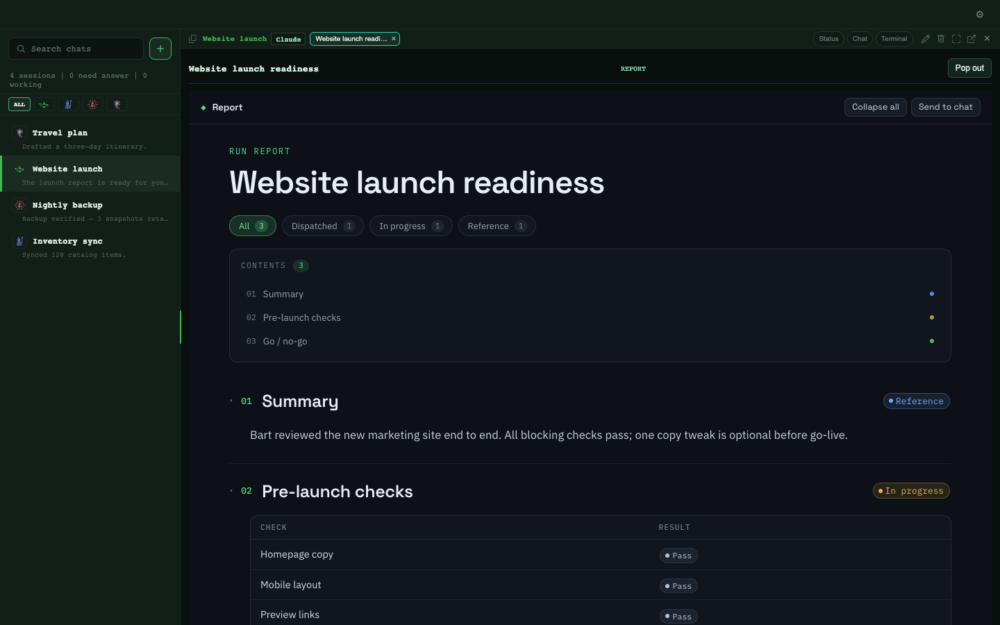

# Agent reports and assets

Agents publish **reports** — structured, readable documents you review inside
Pentacle. Open a report to read its sections, status and tables, click any block
to leave a short comment, and send that feedback back to the producing agent. It
is a lightweight review loop, not an approval workflow.

*Sample data.* The screenshot uses invented report content; no real work or
machine names are shown.

For the publish format, section/block vocabulary and the comment/feedback
contract, see [Report assets](report_assets.md).
