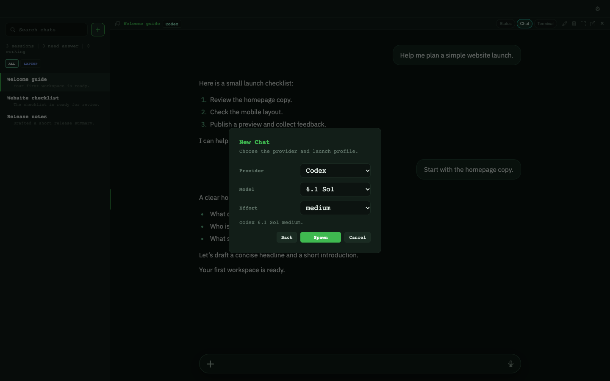
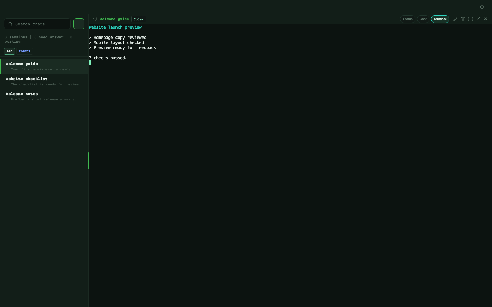

# Pentacle Web screenshots

These screenshots use invented tasks and text in a single-machine workspace.

## Chat

Open a session to read its conversation and send the next message.

## New Chat

After selecting your machine, choose the provider, model and effort, then Spawn.

## Terminal

Switch the same session to Terminal to see its terminal output.

## Capture notes

Captured on 2026-10-02 from app source
`51bafc2c263aa935b32ec0894b99e6c8e9f20f75` in headless Chrome at 1440×900.
The `onboarding-single-host-v1` fixture supplies one synthetic machine labelled
Laptop, three invented tasks (Welcome guide, Website checklist, Release notes),
a website-planning conversation and synthetic terminal output. The built web
renderer receives fixture state through its normal browser IPC transport;
no live daemon or account is connected. The session is maximized using its
normal header control. New Chat shows the provider/model step.

The implementation capture pass inspected every image for personal names,
phone numbers, real machine names, emails, credentials and file paths.
