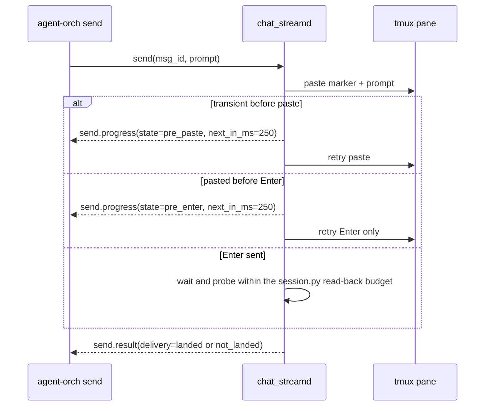

# agent-orch

Direct CLI for orchestrating agent sessions through `chat_streamd`. Lets one agent spawn, drive, and observe other agents without the leader's LLM context having to read raw tmux scrollback.

→ See [../../docs/ARCHITECTURE.md](../../docs/ARCHITECTURE.md) for system context. Setup guide: see [../../docs/agent_orchestration_setup.md](../../docs/agent_orchestration_setup.md) for installing `chat_streamd`, `agent-orch`, per-machine config, autostart, and smoke tests. The canonical CLI install is `bash services/agent-orch/install.sh` from the Pentacle checkout.

## Architecture in one breath

Agent-orch verbs connect directly to `chat_streamd` over websocket and return the daemon's typed RPC responses. There is no local background process or socket lifecycle to manage. Completion is out-of-band: a sub-agent calls `agent-orch report`, which opens a one-shot websocket to `chat_streamd`, submits a validated structured report, and exits. `agent-orch await` opens its own websocket and blocks on `await_report`; if a terminal report already exists, the daemon resolves from the durable ledger. Sends fence the validated inbox JSON inside the prompt as `<INBOX_V1 msg_id="N">...</INBOX_V1>` so remote sub-agents do not need the leader's filesystem. The removed inbox verb is not a delivery surface: use the git-channel/committed-artifact path as authority, and use the daemon's read-only delivered-record audit only to compare what was already pasted.

QA reports bind an exact candidate commit with `--target-sha FULL_SHA`.

`agent-orch inbox` is intentionally removed in daemon v2. The supported
recipient-side authority channel is the git channel / committed-artifact path:
use `agent-orch send` for report-backed work or `agent-orch tell` for one-way
delivery, both of which always submit immediately. Direct legacy callers receive
the standard `unsupported_in_v2` response.

## Commands

| Command | Purpose |
|---|---|
| `agent-orch spawn [--provider P] [--model MODEL] [--effort LEVEL] [--host H] [--role R] [--phase X] [--objective TEXT] [--spec-id ID ...] [--visibility V] [--parent STREAM_ID] [--handoff] [--confirm-model-change] [--top-level] [--resume SESSION_ID] [--at ISO \| --delay DURATION] [--initial-prompt TEXT \| --initial-prompt-file PATH]` | Issue an immediate `spawn` RPC, or create a durable daemon schedule when `--at` or `--delay` is present. Fresh scheduled spawns default to creator-as-parent; `--parent` and `--top-level` select the other lineage shapes. Scheduled `--handoff` preserves the retiring-seat workflow. Non-handoff spawns require `--provider` and resolve the configured `agent_orch` profile. Handoffs inherit omitted provider/model/effort fields from the retiring stream's observed effective tuple; see "Handoff." `--host` defaults to the CLI's resolved local host id (`AGENT_ORCH_HOST_ID` env, `local_host_id` in config.json, or hostname-derived — see the Configuration table). A non-matching `--host` is allowed; chat_streamd routes the spawn to the named target machine through its existing SSH path and is the source of truth for host availability. Returned `stream_id` matches the requested host (e.g. `linux-workstation:codex-linux-workstation-<ts>` from a coordinator leader). chat_streamd returns `error_code: "unsupported_host"` for hosts not in its `machines.json` and `error_code: "host_offline"` for hosts whose 1-Hz online probe is failing; the CLI preserves both as the `error` and `reason` fields. `parent_stream_id` defaults to leader's discovered id unless `--handoff`, explicit `--parent`, or `--top-level` changes the lineage. `--top-level` suppresses parent auto-inference and is useful with `--resume` from inside a registered session; it is incompatible with `--parent` and `--handoff`. `--objective` (an immutable one-line goal, at most 120 code points) is required only for a parented child spawn — it labels the child on the parent's sub-agent roster; a top-level, `--top-level`, or `--handoff` spawn (parent None) sets its own goal, so the daemon derives the objective from the brief and an explicit `--objective` stays optional. Ownership-level sessions require `--spec-id`; repeat it for multiple tags. A changed handoff tuple warns and proceeds; `--confirm-model-change` suppresses only that warning. |
| `agent-orch await-spawn (--request-id RID \| --stream-id SID) [--timeout N]` | Resolve a spawn to its durable pending, succeeded, or failed outcome. |
| `agent-orch spawn status <key\|request_id> [--host H]` | List the outcome/reservation rows and any admission hold for a spawn key or request id. See "Idempotent spawn retry, in-flight cancel, and admission freeze." |
| `agent-orch spawn cancel <key\|request_id> [--host H]` | Cancel a pre-bind spawn (terminal `cancelled`); after bind returns `cancel_after_bind` naming the stream id to close instead. |
| `agent-orch spawn freeze [--host H] [--reason R] [--ttl S]` / `agent-orch spawn unfreeze [--host H]` | Set/clear a TTL'd daemon admission hold for a deploy window; while held new spawns are refused with `spawn_frozen`. |
| `agent-orch schedule list [--json] [--state STATE]` | List schedule rows. Without `--json`, prints `schedule_id`, `state`, `fires_at_utc`, `target_host`, `provider`, and a prompt preview. |
| `agent-orch schedule get <schedule_id> [--json]` | Fetch one schedule. The daemon dereferences blob-backed prompts and returns `prompt_storage` plus `initial_prompt_b64`; human output prints the decoded prompt after the row table. |
| `agent-orch schedule cancel <schedule_id>` | Cancel a pending schedule; terminal states return `schedule_terminal_state`. |
| `agent-orch schedule reschedule <schedule_id> (--at ISO \| --delay DURATION) [--allow-past-time] [--allow-far-future]` | Re-arm a schedule for a new UTC fire time. Valid on every state; terminal-state re-arm resets retry bookkeeping and preserves the prior `fire_result_stream_id` until the next successful fire overwrites it. |
| `agent-orch schedule run <schedule_id>` | Move a `pending` or `pending_retry` row to fire immediately. Terminal states and `fired_in_progress` return `schedule_terminal_state`; use `reschedule` to re-arm terminal rows. |
| `agent-orch send [--retry] <stream_id> <msg_id> <prompt>` | Issue `send` RPC. `msg_id` is unique per target stream. `--retry` is accepted when the latest entry for `(msg_id, stream_id)` is `send.result` with `delivery:"not_landed"`, `send.error`, `transmit_failed`, `transmit_delivered_awaiting_result`, or `send_error`. The CLI builds and validates a minimal Inbox v1 envelope from the prompt, carries it inline to the daemon, and the daemon re-validates it. |
| `agent-orch tell <peer_stream_id> <text> [--from STREAM_ID] [--ttl SECONDS] [--tell-id UUID] [--urgent]` | Direct one-way peer message. The daemon pastes immediately through the always-submit path and returns a durable completed-delivery receipt; `submission_confirmed` is post-hoc evidence, not a readiness gate. |
| `agent-orch park <stream_id> --reason TEXT [--from STREAM_ID]` / `agent-orch unpark <stream_id> [--event-id ID --reason TEXT] [--from STREAM_ID]` | Declare or clear a session's parked state. The CLI is authorized for the target stream or its direct parent; the Pentacle desktop operator surface has the separate operator-confirmed path. A routing-integrity park requires its exact event id and a non-empty acknowledgement reason. Parked sessions receive no system nudges. |
| `agent-orch notify (--message TEXT \| --ask TEXT) [--title TEXT] [--producer NAME] [--severity info\|warning\|critical] [--ttl SECONDS] [--button LABEL ... \| --actions JSON] [--await-answer] [--timeout SECONDS] [--from STREAM_ID]` | Publish an operator-facing notification through `chat_streamd`. `--message` creates a message-only Updates card with no buttons. `--ask` creates an actionable question; `--button` builds yes/no-style actions, while `--actions` accepts a JSON list of notification action objects (if both are supplied, `--actions` takes precedence). With `--await-answer`, the CLI records the publishing stream as `answer_to_stream_id`, blocks on `notification.await`, and prints the typed answer payload. |
| `agent-orch prompt ask --title TEXT --body TEXT [--question-id ID] [--spec-id ID] [--response-mode single_choice\|multi_choice\|free_text] [--option LABEL[=VALUE] ...] [--from STREAM_ID] [--provider NAME] [--ttl SECONDS] [--await-answer] [--timeout SECONDS]` | Standard operator-question protocol (verified, operator-visible producer only). Creates or refreshes a durable `agent_question.v1` record through `chat_streamd`, publishes one deduped Updates card, and returns immediately by default. Admission caps: title ≤90, body ≤1200 code points in blocks of ≤300 / ≤3 lines, 1–5 options with labels ≤40 and descriptions ≤100; no `ack` mode and no separate `--context` (put context in `--body`). Every question admits free text. If daemon/auth/store failure prevents durable creation, returns `prompt.fallback` plus an `AGENT_QUESTION_V1` inline block. |
| `agent-orch prompt answer <question_id> [--select VALUE ...] [--text TEXT]` | Answer a durable question with the one canonical payload: selected option value(s) and/or free text. A choice takes selections and/or text; `free_text` takes `--text` only. |
| `agent-orch prompt status <question_id>` / `agent-orch prompt list [--from STREAM_ID] [--spec-id ID] [--open] [--limit N]` | Recover durable prompt state. `status` reads one question and answer by `question_id`; `list` finds open or answered questions by producer stream or spec, including after the asking stream has closed. |
| `agent-orch triage scan-publish --memory-root PATH [--limit N] [--dry-run]` | Scan shared-memory source work files for backlog specs tagged `triage`, create/update each item's `triage.json`, and publish bounded Updates cards with stable dedup keys. `--dry-run` prints notification payloads without contacting `chat_streamd`. |
| `agent-orch triage apply-answer --memory-root PATH --spec-id SPEC (--action keep\|defer\|deprecate \| --merge-target SPEC \| --answer-json JSON) [--decided-by NAME] [--reason TEXT]` | Apply an operator triage disposition idempotently. `keep` removes the `triage` tag and writes a triage note; `deprecate` moves the item to `work/deprecated`; `merge` appends a pointer to the target and deprecates the source. |
| `agent-orch asset [publish] --title TEXT --type report --content-file PATH [--tag TAG ...] [--session STREAM_ID] [--asset-id ID] [--spec-id ID] [--timeout N]` | Publish a structured JSON review asset into a chat session. Without `--session`, the CLI uses `discover_leader_stream_id_short()` to bind the asset to the caller's own stream. `--asset-id` republishes the same tab in place; omitting it creates a new asset. `--spec-id` makes the asset discoverable from future chats carrying that spec id. |
| `agent-orch asset list [--session STREAM_ID] [--spec-id ID] [--timeout N]` | List assets for a session, or spec-anchored assets for a spec id. |
| `agent-orch asset comments <asset_id> [--session STREAM_ID] [--spec-id ID] [--unresolved] [--timeout N]` / `agent-orch asset comments resolve <asset_id> <comment_id> [--note TEXT]` | Fetch report comments for review iteration, and mark addressed comments resolved with an optional resolution note. |
| `agent-orch title "<text>" [--timeout N]` | Self-rename the calling chat. The CLI resolves its own stream id, splits `host:session_name` on the first colon, and sends the daemon `rename` RPC with `source:"agent"`. There is no target argument; this verb cannot rename another session. |
| `agent-orch status [--goal TEXT] [--plan STEP ...] [--step-done N[,N] ...] [--update TEXT] [--handoff-planned\|--no-handoff-planned] [--timeout N]` | Set/update the calling session's status card (self-write only; the CLI resolves its own stream id and sends the daemon `status_card` RPC with its stream token). Partial updates: only provided flags change. `--plan` is repeatable (one step per flag) and **replaces** the whole plan, activating step 1; repeat `--step-done` or pass a comma-list to mark several 1-based steps in order. Caps: goal ≤500 chars, update ≤300, step ≤200, plan ≤20 steps. The daemon stamps `updated_at`, persists the card on the sessions row, and rebroadcasts `session.inventory`. At least one field flag is required (exit 2 otherwise). |
| `agent-orch visibility set <stream_id> <default\|nested\|hidden>` | Issue `set_visibility` RPC. Updates the session's persisted visibility and triggers a `session.inventory` rebroadcast so subscribed clients (Pentacle desktop, Pentacle Mobile, direct agent-orch CLIs) re-filter within one tick. The success frame carries the updated session summary. |
| `agent-orch await [--include-details] [--include-extras] [--timeout N] --from <stream_id> [--msg-id N]` | Open a direct websocket and block until `chat_streamd` resolves `await_report`. `--msg-id` is optional. **msg_id mode** (`--from <stream> --msg-id N`) waits for the exact `(stream_id, msg_id)`. **Stream mode** (`--from <stream>` with no `--msg-id`) waits for the stream's terminal report for **any** `msg_id` or for the session to close, returning the terminal report else a `closed_without_report` result (see "Stream-mode await"). `progress` reports are observed but do not complete the await. Default `--timeout` is 30s in msg_id mode and 900s in stream mode; an explicit `--timeout` always wins. `--include-details` and `--include-extras` request those fields from the daemon response. |
| `agent-orch inspect <stream_id> [--msg-id N] [--event-tail N] [--full \| --max-text N] [--json]` | Ask `chat_streamd` for the stream's current session status, recent daemon-held chat events, and the best existing terminal report for `msg_id` if supplied. Pretty output truncates event text at 160 characters by default; `--full` disables truncation. |
| `agent-orch ledger get <tell_id>` | Read one durable peer-message ledger row through `chat_streamd`, including its exact stored text, route, delivery state, timestamps, and attempt metadata. This works from any configured peer; callers never read the daemon host's SQLite file directly. |
| `agent-orch audit inbound [STREAM_ID] [--limit N]` | Read a bounded list of already-delivered tell frames addressed to a stream. The view is derived from completed delivery records and cannot defer, hold, queue, or redeliver anything. |
| `agent-orch report [--msg-id N] --status done [--result JSON \| --result-file FILE] [--reason R] [--report-id UUID] [--qa-verdict accept\|reject] [--target-sha FULL_SHA] [--qa-attestation-stream-id STREAM --qa-attestation-report-id REPORT] [--from-stream-id STREAM_ID] [--timeout N] [--terminate]` | Direct completion RPC for sub-agents. v2 accepts inline `ReportPayloadV1` through `--result` and persists it in `v2_reports`; `--qa-verdict`, `--target-sha`, and paired QA-attestation flags add typed top-level fields without a hand-written JSON envelope, while conflicts fail loudly. When `--result-file` is paired with `--qa-verdict` or `--target-sha`, the CLI parses the file, merges absent typed fields, enforces inline caps, and submits inline; without either QA flag, the legacy blob upload remains rejected as `unsupported_in_v2`. With `--terminate`, closes the reporting session after `report.ok`. A response-loss probe uses the exact report ID: a durable row emits typed `report.durable_confirmed` and exits `0` for every confirmed state; nuance is in its `state`. `--msg-id` is the inbox message this report answers; it is **optional with `--terminate`** (defaults to `0` for a tell-driven worker with no awaitable `msg_id`) and required otherwise. A payload that fails validation prints the offending field(s) instead of a bare `schema_error`. |
| `agent-orch close [--reason R] [--operator-confirm] [--force\|--defer-if-working] [--from-stream-id STREAM_ID] [--caller-stream-id STREAM_ID] [--progeny STREAM_ID] [--timeout N] <stream_id>` | Direct `close` RPC. Like `report`, this opens its own websocket directly to chat_streamd (`close_once`), so it works from any context with a valid config. `agent-orch close --operator-confirm $AGENT_ORCH_STREAM_ID` is therefore the **universal self-close** (see "Universal self-close" below). `--reason` default `"manual"`. `--operator-confirm` sets `operator_confirm=true` on the wire so the daemon will accept the close for operator-shape session names; the daemon-side identity check also requires the caller stream to be the close target itself, the target's `parent_stream_id`, or the desktop-UI surface (see chat-stream README "Operator-kill safeguards"). `--defer-if-working` persists a generation-fenced close intent and returns `close.ok` with `deferred:true`; bare close retains the `session_working` refusal. `--force` closes immediately; later process cleanup is reconciler-owned. Exit codes: `0` on `close.ok` or idempotent `close.already_closed`; `1` on `close.error`; `2` on malformed input; `64` unreachable; `66` auth failure; `67` timeout. |
| `agent-orch drain-sessions --operator-confirm <host>:<session_name> [<host>:<session_name> ...] [--timeout N]` | Issue the compatibility `drain_sessions` RPC with explicit intent. The generic agent-orch transport is not an operator credential and the daemon returns `drain_sessions.error error_code="operator_trust_required"`; the CLI prints that typed refusal without fallback or retry. Operands remain exact `host:session_name` keys and wildcards are rejected locally. A future credentialed admin CLI is separate scope. |
| `agent-orch reconcile status [--host HOST] [--json] [--timeout N]` | Read-only daemon reconciliation audit. Returns counts and row details for open rows whose session is dead, open rows whose host is unreachable, closed rows with unreaped survivor state, and unmanaged trees. Live sessions with no durable row are folded into `unmanaged_tree`. |
| `agent-orch reparent <stream_id> --to <new-parent> [--from-stream-id STREAM_ID] [--caller-stream-id STREAM_ID] [--reason R] [--timeout N]` | Direct `reparent` RPC. Move a DIRECT-child worker `<stream_id>` to `--to` within the SAME daemon and SAME host (cross-host reparent is refused in v1). Authorized by one of four rows — new-parent (caller owns `--to`), old-parent (caller owns the worker's current parent, allowed even while self-closing), handoff-successor (caller's `handoff_from_stream_id` == the worker's current parent), or operator-UI (`hello.client == "pentacle"`). `--from-stream-id` is the caller's asserted stream (token-verified; defaults to the local leader); `--caller-stream-id` overrides only the audit actor. On success the daemon persists the new `parent_stream_id`, updates the summary, writes a `reparent` lifecycle audit (old+new parent ids), and emits `session.inventory`. Typed refusals: `reparent_worker_not_found`, `reparent_unauthorized`, `stream_ownership_unverified`, `reparent_stale_successor`, `reparent_non_direct_descendant`, `reparent_cross_host`, `reparent_target_closed`. This is the supported replacement for the default-visibility-promotion reap shield. |
| `agent-orch list` | Fetch the current daemon snapshot and print visible sessions as JSON. Direct snapshots include subagents. |
| `agent-orch ssh <ssh args...>` | Thin passthrough to `ssh(1)` with `-o SendEnv=PENTACLE_STREAM_ID AGENT_ORCH_STREAM_ID AGENT_ORCH_STREAM_TOKEN_FILE AGENT_ORCH_STREAM_TOKEN` prepended, so the running session's leader stream id and private token-file path propagate across the SSH hop (the legacy token name remains for pre-file sessions). Dispatched via a pre-argparse `sys.argv` intercept so leading ssh flags (`-i`, `-v`, `-h`, `-p`, `-J`, `--`) pass through verbatim, then exec'd via `os.execvp("ssh", ...)`. The sshd side must accept those env names — see `deploy/README.md` for the matching `AcceptEnv` drop-in (redeploy on every host before enabling ownership enforcement). |

`agent-orch list` carries `requested_model`, `requested_effort`, `effective_model`,
`effective_effort`, and `routing_integrity` on every row. `model` and `effort` are
backward-compatible aliases for the requested tuple. Use `inspect` for the authoritative
per-session audit trail; use list fields to detect fleet-wide routing drift.

Spawn defaults are deployment data in
`services/_shared/spawn_defaults.json`: provider baselines and optional
per-host overrides are resolved by both the CLI and daemon. `spawn_catalog_get` returns
the active policy read-back; handoff policy is colocated in that file but enforced by the
handoff guard.

## Peer messaging

Use `agent-orch send` when the sender owns a `msg_id` and expects a completion report that it will await. The CLI builds a minimal Inbox v1 envelope with `from` set to the discovered leader stream id or `null`, `to` set to the target stream id, `task` set to the prompt text, and empty `inputs` / `extras`. The daemon re-validates that envelope and returns `inbox_invalid` for malformed evidence.

Peer sends are stamped for provenance. When the daemon sees a `from_stream_id` backed by an authenticated actor, it wraps the prompt that lands in tmux in the shared peer-delivery envelope (`chat-stream-v2` `comms.py` `_peer_delivery_wire`):

```text
[from <stream_id>] [send:<send_id>]
<text>
```

`agent-orch tell` is stamped the same way with a `[tell:<tell_id>]` anchor. Both provider normalizers classify the enveloped delivery as `kind:TELL` with structured `sender`/`peer_payload`, so the recipient's transcript renders it as a distinct peer/agent row rather than the operator's own bubble. Operator sends (no `from_stream_id`) and daemon housekeeping stay unstamped, and the header-stripped payload is what feeds delivery-proof matching, so `submission_confirmed` is unaffected.

Use `agent-orch tell` for one-way peer messages where the sender should continue immediately. In daemon v2 the paste is always submitted immediately, and the completed delivery record is available through `agent-orch ledger get` or `agent-orch audit inbound`; `submission_confirmed` is evidence, not a gate:

```bash
agent-orch tell linux-workstation:codex-linux-workstation-1779000000 "I touched the shared parser; reload before your next test."
agent-orch tell "$PEER" "retry-safe note" --from "$AGENT_ORCH_STREAM_ID" --ttl 900 --tell-id 6f1027b2-66f7-4422-a5fc-7b693cccb256
```

`--from` overrides sender discovery (`AGENT_ORCH_STREAM_ID` / tmux-session discovery). `--ttl` remains a bounded compatibility field (`1` through `3600`) and is not a queue or hold instruction. `--tell-id` is the idempotency key; when omitted the CLI generates a UUID4, and when supplied retries with the same payload return the original `tell.ok` instead of creating a duplicate delivery. `--urgent` may send one Escape before the same immediate paste path; it does not add a readiness gate. Targets in any pane state receive the paste, and `submission_confirmed` records only whether post-hoc evidence was observed.

`tell` opens a direct one-shot websocket to `chat_streamd` and sends the same
daemon-owned `tell` RPC through the same direct websocket path as the other verbs.

Success response:

```json
{"type":"tell.ok","request_id":"tell-<uuid>","tell_id":"<uuid>","ledger_row_id":123,"delivery_status":"delivered","submission_confirmed":true}
```

`delivery_status` is `"delivered"` after the unconditional paste and the durable completed-delivery record is written. `submission_confirmed` is post-hoc pane evidence; false does not void or retry the delivery. When a Codex paste committed (left the composer, no active draft) but its post-watermark USER-event proof is still ingesting, `delivery_status` is `"committed_pending_proof"` with `action_committed:true` and `do_not_resubmit:true` — a non-fatal, do-not-resend state that promotes to `delivered` when the event lands (see the send section's `committed_pending_proof` note); `tell` still exits 0. If the target stream closed with a successor, the daemon forwards the tell to the final live successor and records `original_to_stream_id` plus route hops. `agent-orch ledger get <tell-id>` and `agent-orch audit inbound <stream-id>` expose the exact text and route evidence later. Stable daemon errors include `peer_session_unknown_from`, `peer_session_unknown_to`, `terminated`, `route_loop`, `route_depth_exceeded`, `text_too_large`, `invalid_ttl`, and `tell_id_replay_conflict`.

`agent-orch list` and `agent-orch inspect` expose each session's computed `turn_state` (`idle`, `working`, `parked`, `limit_stalled`, or `unknown`), `turn_state_since`, and raw `turn_state_sources`. Source precedence is parked over limit-stalled over activity over unknown; lower-priority masked sources remain visible. `agent-orch park` sets the park source with a required reason and `agent-orch unpark` clears it. Stable park errors are `park_unauthorized`, `park_target_closed`, `park_not_found`, and `unpark_not_parked`.

System nudges route through the same delivery primitive as tells. `delivery_kind:"nudge"` uses backoff by `(target, kind, reason_key, state_epoch)`: first fire immediately, then 3 minutes, 15 minutes, and 60 minutes repeated at cap. Child-liveness nudges use the child's idle/spawn-inert episode as `state_epoch`; a stable watermark cannot suppress a due repeat. Their text includes a copy-paste park command. Parked targets suppress nudges completely. A working transition clears only the idle-nudge episode (cadence reset), never the park; park clears solely via an explicit `unpark` or a terminal report. A direct-parent inspect, tell, await, or park resets the no-action escalation count; after `PENTACLE_CHILD_LIVENESS_ESCALATE_CAP_FIRES` hourly-cap fires (default three) without one, the daemon emits one operator Updates warning. One-shot `delivery_kind:"reengage"` messages are event-id deduped separately and are not swallowed by nudge backoff.

## Notifications

Use `agent-orch notify` when an agent or automation needs to publish into the operator Updates feed without spawning or sending a prompt to another agent:

```bash
agent-orch notify --message "scrape done, populated 142 leads" --producer altum-scraper
agent-orch notify --ask "Re-run the scrape?" --button Yes --button No --await-answer --timeout 900
```

`--message` sends `notification.create` with `actions: []`, so the card is message-only and has no implicit acknowledge button. `--ask` uses the prompt text as the card body and attaches actions. Repeated `--button` labels become `yes_no` actions with position-stable ids (`a0`, `a1`, ...); labels that look affirmative produce `choice:true`, labels that look negative produce `choice:false`, and otherwise the first button is true. `--actions` is the escape hatch for exact action objects, including `run_command`, `spawn_worker`, custom labels, values, and explicit `action_id` values. Missing ids are still assigned by position before the create RPC.

`--title`, `--producer`, `--severity`, and `--ttl` map directly to the notification create fields. If `--producer` is omitted, the CLI uses the discovered caller stream id, falling back to `agent-orch`. The verb is provider-agnostic; it uses the caller stream identity and the daemon notification RPC, not Claude- or Codex-specific state.

With `--await-answer`, the CLI requires a discoverable publishing stream (or `--from STREAM_ID`), stores it as `answer_to_stream_id`, then blocks on `notification.await` for the created notification id. On success it prints only the typed answer object:

```json
{"notification_id":"n-...","action_id":"a0","action_kind":"yes_no","label":"Yes","choice":true,"by":"client:pentacle","actor_class":"unverified_direct_client","actor_verified":false,"at":"2026-06-19T20:40:00.000000+00:00"}
```

`choice` is present only for `yes_no`; `value` is present only when the selected action or resolution carries one. If the row is already terminal, `notification.await` returns immediately. If the timeout expires, the daemon returns a typed `notification.await.timeout` frame with `error` and `reason` set to `await_timeout`, and the CLI exits nonzero after printing that response. Independently of the blocking wait, the daemon also delivers a `notification.answer` JSON tell back to `answer_to_stream_id` over the durable always-submit path, so a reconnecting or non-blocking publisher can compare it through `agent-orch audit inbound <answer_to_stream_id>` or `agent-orch ledger get <tell-id>`; the answer is read from the durable delivery audit, never a pull surface.

## Prompt Protocol

`agent-orch prompt` is the standard protocol for agent-to-operator questions. It is provider-agnostic: stream ids and optional provider labels are metadata only, so Codex and Claude callers use the same `agent_question.v1` envelope. Agents should use `prompt ask` instead of ad hoc chat questions when operator input is needed.

`prompt ask` validates the envelope, sends `prompt.ask` to `chat_streamd`, persists the question by `question_id`, and publishes an operator Updates card through the notification store. Repeating the same open `question_id`/dedup key refreshes that card instead of creating another one. The command returns `prompt.ask.ok` immediately unless `--await-answer` is set; answers still come only through the authenticated notification resolve path.

When the producing seat has a lineage parent, the daemon also sends that live
parent an idempotent `prompt_question_ready` tell. `prompt.ask.ok` carries its
`notice_delivery` receipt. Only a stream-token-authenticated producer can cause
this peer injection; a foreign producer is refused before question, card, or
tell mutation. Exact replay returns the existing card and authoritative stored
tell receipt, including after the question is answered or dismissed, while
changed material for the same addressed question in any state fails with
`prompt_question_replay_conflict`. The CLI exits nonzero when an authorized
receipt is queued or failed, while leaving the durable question available
through `prompt status`, so a window request cannot look successfully delivered
while waiting silently.

Question mutations fail closed with `question_unauthorized`: a connection-authenticated desktop/mobile operator may answer or dismiss any question, while a stream-token-authenticated seat may mutate only a question whose `producer_stream_id` is that seat. The same rule covers `prompt.answer`, `prompt.cancel`, `notification.resolve`, and agent-question `notification.resolve_by_dedup`; caller-supplied actor claims grant no authority.

If daemon connection, auth, or notification-store availability fails before durable creation, `prompt ask` returns a typed fallback response:

```json
{"type":"prompt.fallback","ok":false,"error_code":"daemon_unreachable","question_id":"q-..."}
```

It also prints an `AGENT_QUESTION_V1` block to stderr so the agent can paste a structured inline question when `chat_streamd` is unavailable. That fallback is explicitly non-durable; answers received in ordinary chat must be copied into the active spec or task record when they matter for cold resume.

Durable V1 response modes are `single_choice`, `multi_choice`, `ack`, and `free_text`. Choice options use `--option LABEL` or `--option LABEL=VALUE`; optional option descriptions use repeatable `--option-json '{"label":"Label","value":"value","description":"Optional detail"}'`. The legacy `--option` form has no description syntax, and mixed `--option` / `--option-json` declarations preserve argv order.

Choice prompts may opt into a custom free-text answer with `prompt ask --allow-custom`. Answers then use `prompt answer --custom-text "typed answer"` by itself, or alongside `--value` / repeated `--selection`. `custom_text` is distinct from `text`: `text` is the whole-answer payload for `free_text` questions, while `custom_text` is the custom/other field for choice questions. Notification quick actions remain predefined option buttons only; clients that expose custom answers submit them through the in-app prompt/notification resolve path.

The optional top-level `note` field is the per-answer note channel for every answer form (`value`, `selections`, `ack`, `text`, and `custom_text`). `prompt cancel --note` is cancellation-only and does not create an answer note.

`prompt answer --by` and `prompt cancel --by` remain accepted for compatibility, but the value is stored as `claimed_by` only. The daemon derives `by` and the additive actor fields from the authenticated one-shot connection; a token-bearing agent relay uses its exact server-bound stream id, while an unverified direct client remains functional but is never recorded as an operator.

`prompt status <question_id>` reads the stored question, including `answer`, after the producing stream is closed. `prompt list --from <stream_id>` and `prompt list --spec-id <id>` let a successor find unresolved, answered, or consumed questions; add `--open` to show only unresolved questions. The linked `agent_question.v1` notification includes a client `question` object (`question_id`, `producer_stream_id`, `response_mode`, ordered `options`, `allow_custom` when true, `state`, and `answer`) on live broadcasts and `notification.list` so UI clients can render the same durable state. `answered` is the delivery-pending question state; a successfully accepted answer tell transitions it to terminal `consumed`, which clients must not render as an actionable prompt card. `--await-answer` is optional convenience only: durable state is in the question row, not in the best-effort answer tell.

## Triage Queue

`agent-orch triage` consumes follow-up specs created by the spec-closure retro hook. It reads the shared memory working tree directly instead of `catalog/*.json`, because catalogs can lag Syncthing. A triage item is a normal `work/backlog/<repo>__<topic>/` item whose spec frontmatter includes the `triage` tag.

`scan-publish` creates one sidecar file per item, `triage.json`, with the stable queue state: spec id, source path, generation, status, dedup key, decision fields, merge target, and defer reason. The Updates notification uses `yes_no` actions with explicit `value` fields (`keep`, `defer`, `deprecate`, or `merge:<target_spec_id>`), so `apply-answer` can consume either a typed `notification.await` answer object or an explicit CLI action. Duplicate answers are safe: terminal triage states (`kept`, `merged`, `deprecated`) are no-ops.

Merge is bounded. The card offers merge actions only for concrete same-repo candidate specs; there is no free-text mobile merge target. When no target is known, operators can defer, then rerun with `--merge-target` after choosing the destination.


## Assets

`agent-orch asset` carries the caller stream and stream token for every exposed
read or mutation. Publishing without `--spec-id` automatically anchors only
when the caller has exactly one provenance-qualified spec binding; use an
attached `--spec-id` to resolve a multi-spec caller. Tags and a self-attachment
never create a qualified binding, and a terminal report body remains the full
QA verdict rather than an asset reference.

Qualified bindings are durable records of `spawn_explicit`, `parent_inherited`,
`handoff_inherited`, or `operator_v2`, including the granting principal and
grant timestamp; the daemon authorizes anchored reads from those records only.

Use `agent-orch asset` when an agent needs to publish a structured report JSON document into its own session slot:

```bash
agent-orch asset --title "QA findings" --type report --content-file /tmp/qa-report.json --tag docs --asset-id qa-findings
```

`--content-file` is read as UTF-8 and validated locally before the websocket publish. It must satisfy the structured report schema documented in `../../docs/report_assets.md`; legacy content types are rejected before websocket traffic.

If `--session` is omitted, the CLI uses `discover_leader_stream_id_short()` and publishes to the caller's stream. If `--session` is supplied, the daemon still requires the caller's stream-ownership token for that exact stream; unauthorized or closed sessions fail with typed asset errors. The publisher is provider-agnostic and uses the `asset.publish` RPC exposed by `chat_streamd`.

Republishing with the same `--asset-id` updates the existing asset tab and body in place. Omitting `--asset-id` creates a fresh asset id. The daemon broadcasts metadata only; desktop clients fetch the body lazily when the operator opens the tab. Protocol details live in [../chat-stream/docs/assets.md](../chat-stream/docs/assets.md).

## Self-titling

Agents self-title with `agent-orch title "<succinct durable goal>"` once they understand the session goal. The shared AGENTS.md rule is the primary mechanism; the daemon only backstops desktop-opened interactive chats with a low-frequency naming nudge through the same peer-delivery path when they remain unnamed.

## Spawn visibility

When `--visibility` is omitted, `agent-orch spawn` materializes `"default"` for handoffs, `--role nexus`, and parentless spawns (including `--top-level`). A non-Nexus spawn with a parent leaves visibility unset so the daemon resolves it to `"nested"`. Explicit `default`, `nested`, and `hidden` always override this inference.

## Handoff

`agent-orch spawn --handoff` creates a new top-level session for another leader, not a nested child. The CLI sends `handoff:true`, discovers the caller's stream id as `handoff_from_stream_id`, omits `parent_stream_id`, and defaults `visibility` to `"default"` unless the caller explicitly passes `--visibility`. `--handoff` is incompatible with `--parent`.

The retiring row's observed `provider`, `effective_model`, and `effective_effort` are authoritative. Each omitted tuple flag inherits that value, including cross-provider handoffs; missing source/effective metadata fails closed and never falls back to fleet defaults or host overrides. Explicit aliases are canonicalized through the shared spawn catalog. A canonical tuple change proceeds and emits one `WARNING` naming the exact changed fields, prior tuple, and requested tuple. `--confirm-model-change` suppresses only that compatibility warning; it is never an approval or execution gate. Older CLI tuple metadata is accepted field-compatibly and is neither validated nor recorded as an override.

Pass the compatibility flag only when the successor should suppress the local changed-tuple warning:

```bash
agent-orch spawn --handoff --effort xhigh --confirm-model-change \
  --initial-prompt "Continue the lane."
```

**Auto-re-parenting of same-host children.** When a leader retires via `spawn --handoff`, the daemon automatically re-parents the retiring leader's SAME-HOST direct children onto the new successor, so live workers keep a live parent and stay protected from reaping. Cross-host direct children are NOT re-parented in v1 (consistent with the cross-host `reparent` refusal): they stay on the retiring leader, are audited `handoff_child_not_reparented_cross_host`, and remain protected because live workers are promoted, never killed. Pass `--no-reparent-children` to opt out and leave every child on the retiring leader. Internally this reuses the `reparent` store update + the `reparent` audit (`auth_row=handoff_successor`); it does NOT re-run the per-child authorization matrix. See the chat-stream `docs/chat_protocol.md` "reparent" section for the matrix and effects.

**Progeny forwarding.** `spawn --handoff` also records the retiring leader as a closed-stream predecessor of the new leader. Tells and child-report notifications addressed to the old stream are forwarded to the final live progeny and external senders are redirected there for future sends. Liveness/heartbeat noise is not forwarded. Successor chains resolve to the final live stream with a bounded loop guard. The same pointer can be set explicitly with `agent-orch close --progeny <successor> <old-stream>`.

```bash
agent-orch spawn --handoff --host coordinator --initial-prompt "Implement the completed spec and report back to the lead."
agent-orch spawn --handoff --host linux-workstation --initial-prompt-file /tmp/handoff_prompt.md
```

The daemon stores `handoff_from_stream_id` on the session row and echoes it in `snapshot.sessions`, `session.inventory`, and `chat.event` session summaries. The field is audit lineage only: it does not make the new session a child and does not hide it from default subscribers.

Fleet activation uses `deploy/install_fleet_spawn_tooling.py --commit <full-main-sha> --host-config /path/to/release-hosts.json --hosts coordinator,workstation --run-host coordinator`. The installer stages and verifies every immutable release before switching any active pointer, then reads every pointer back; daemon-side handoff rejection must not deploy until all configured targets report the same CLI SHA.

The spawned session inherits `PENTACLE_STREAM_ID=<host>:<session_name>` in its provider process environment, with the value computed from the actual session name passed to tmux. It also receives `AGENT_ORCH_STREAM_ID` with the same value. This lets the new leader call `agent-orch report --terminate` without depending on tmux-name snapshot discovery.

Initial prompt delivery is daemon-owned and reconciled independently from readiness. For provider and remote spawns, a prompt-bearing `spawn.ok` requires `DurableUserEventProof`: a durable USER event from the authoritative current-generation Store, strictly newer than the pre-paste watermark, whose normalized text exactly matches the submitted brief or staged pointer. Pane echo, history, queue, and transcript observations cannot settle `delivered` or authorize a pane-driven retry. A local explicit-command spawn retains its anchored line-echo receipt because that line-oriented test/tool path emits an echo only after submission. Missing proof leaves the durable admitted handle in `starting`; a confirmed failure is `spawn.error`. Never infer submission from `delivery_status`, bounded inspect text, or pane liveness, and never launch a replacement logical spawn while its obligation is pending.

An `initial_prompt_delivery` receipt whose `state` / `delivery_status` is
`pending` is explicitly advisory (`advisory:true`, `authoritative:false`): it
records that the bounded observation window did not prove delivery, not that a
live pane is safe to kill. A pane admitted by the daemon has a durable session
row before readiness and prompt receipt settle, so use its returned `stream_id`
to `inspect` or `tell` it while awaiting the request-id outcome. A deferred
intent is also reconsidered on the normal reconciler cadence; a caller must not
blind-retry the same logical spawn.

```json
{
  "type": "spawn.ok",
  "request_id": "spawn-<uuid>",
  "session": {"stream_id": "linux-workstation:codex-linux-workstation-1779000000", "handoff_from_stream_id": "coordinator:codex-coordinator-1778999999"},
  "initial_prompt_delivery": {"to_stream_id": "linux-workstation:codex-linux-workstation-1779000000", "delivery_status": "delivered", "proof_watermark": 1233, "proof_watermark_state": "reachable", "transport": "direct"},
  "admitted_count": 1,
  "admitted_sessions": ["linux-workstation:codex-linux-workstation-1779000000"],
  "admitted_scope": "idempotency_key",
  "admitted_set_authoritative": true
}
```

The explicit idempotency key defines one logical spawn. The admitted set is
authoritative only within that key: same key and same payload replays the
original reserved stream, while different keys with identical payloads remain
legitimate distinct seats. Payload equality is never a deduplication key.

## Idempotent spawn retry, in-flight cancel, and admission freeze

A `spawn` interrupted before its reply still reaches the daemon and creates a
seat; a naive retry used to mint a duplicate because the key was a fresh
per-process value. The contract closes that gap:

- **Default key.** When neither `--idempotency-key` nor `--request-id` is given,
  the CLI derives `idempotency_key = sha256(parent_stream_id | host | provider |
  model | effort | role | spec_ids | brief)[:32]` — deterministic for one logical
  spawn — and prints `spawn key: <key>` to **stderr before the RPC**. An
  interrupted caller therefore always has the key, even with no reply. Precedence:
  explicit `--idempotency-key` > explicit `--request-id` (the caller's stable
  handle) > derived key. `request_id` stays a per-attempt `spawn-<uuid4>`.
- **Retry returns the existing seat.** A retry with the same inputs (same derived
  key) within the key TTL returns the first outcome — `spawn.ok` with the original
  `stream_id` (and `replayed:true` / `admitted_scope:"idempotency_key"`), or
  `spawn.indeterminate` (exit 3) while the first is still in flight. No duplicate.
- **`agent-orch spawn status <key|request_id>`** lists the outcome and reservation
  rows (state, stream id, payload hash) and any active admission hold, so a caller
  can find the seat before retrying. `found:false` when nothing matches.
- **`agent-orch spawn cancel <key|request_id>`** cancels a request that has not yet
  bound: the daemon releases the reservation on the request-id-fenced path and
  records a terminal `cancelled` outcome (`spawn_cancel.ok`). After bind it refuses
  with `spawn_cancel.error` `error_code:"cancel_after_bind"` naming the `stream_id`
  — the caller closes that seat instead. Cancel is idempotent on an
  already-`cancelled` request; an unknown target is `error_code:"not_found"`.
- **Payload-hash conflict.** Reusing a key for a *different* payload is refused
  with `spawn.error` `idempotency_key_conflict` — a changed brief never silently
  reuses a prior seat.
- **Admission freeze (deploy window).** `agent-orch spawn freeze [--host H]
  [--reason R] [--ttl S]` sets a TTL'd daemon-side hold; while held, new spawns are
  refused with `spawn.error` `spawn_frozen` and `spawn status` shows the hold.
  `agent-orch spawn unfreeze` clears it; the hold also self-expires after its TTL
  so an abandoned freeze never wedges admission. A bounce runbook freezes before
  cutover and unfreezes in its finally after readback.

Legitimate repeated spawns with identical briefs (fleet smoke, walk fixtures)
must pass their own `--request-id`/`--idempotency-key` (or vary the brief) so they
keep distinct keys rather than colliding on the derived one.

`agent-orch list`, full `agent-orch inspect`, `agent-orch await-spawn`, and `agent-orch ledger get <tell-id>` read the same durable receipt across later activity and daemon restart. Multi-kilobyte initial prompts use `transport:"staged"` on the target host (for either provider and any configured host): the complete UTF-8 brief is written atomically, then only a short pointer is submitted. The receipt records the SHA-256, byte size, stage host/path, write timestamp, and pointer acknowledgement; a staged pointer is never submitted before the atomic write completes.

`--initial-prompt` and `--initial-prompt-file` are mutually exclusive. Prompt files at or below `16 KiB` are read as UTF-8 and inlined as `initial_prompt`. Larger files use `upload_prompt_blob`: the CLI uploads chunks to the daemon, receives `prompt_blob_sha`, and sends `initial_prompt_blob_sha` in the `spawn` request. Non-UTF-8 prompt files are rejected as `prompt_blob_invalid_utf8`.

## Scheduled spawns

`agent-orch spawn --at <iso8601-with-offset>` and `agent-orch spawn --delay <duration>` use daemon v2's durable `schedule.insert` path; this is the default mechanism for timed work. A fresh row defaults to the creator as parent, while `--parent` and `--top-level` select explicit-parent and parentless lineage. Adding `--handoff` preserves the future-handoff workflow. The row freezes the exact requested tuple, the daemon-resolved tuple, owner spec bindings and provenance, lineage, target host, options, target SHA, attestation, and captured prompt after the same read-only admission checks used by immediate spawn.

Submit-time validation requires the resolved time to be strictly later than `now + 60s` and no later than `now + 365d`. `--allow-past-time` bypasses the lower-bound rejection; `--allow-far-future` bypasses the upper-bound rejection (`services/agent-orch/agent_orch/cli.py::_resolve_schedule_fire_time`). `--at` timestamps must include an explicit UTC offset; `Z` is accepted (`services/agent-orch/agent_orch/cli.py::_parse_iso8601_with_offset`).

An explicit `--self-close-on-completion` or `--no-self-close-on-completion` is serialized as the corresponding boolean for both immediate and scheduled handoffs. Handoff lineage satisfies the daemon's parent-lineage requirement, and the scheduled row re-emits the flag when it fires. A leaderless/top-level spawn omits either lifecycle bit because self-close authorization requires lineage; its durable default is false.

Example:

```bash
agent-orch spawn --provider codex --delay 3h \
  --initial-prompt "Run the scheduled check and report with --terminate."

agent-orch spawn --handoff --provider codex --delay 3h \
  --initial-prompt "Resume the deployment check and report with --terminate."

# For explicit cases, replace the placeholder with any ISO 8601 timestamp with offset, > now + 60s.
agent-orch spawn --handoff --provider codex --host linux-workstation \
  --at "<future-ISO-8601-with-offset>" \
  --initial-prompt-file /tmp/next_leader.md
```

The schedule verbs are:

| Command | Behavior |
|---|---|
| `agent-orch schedule list [--json] [--state STATE]` | Lists visible rows, optionally filtered by a native v2 state. |
| `agent-orch schedule get <id> [--json]` | Returns the authorized row and its frozen audit fields. |
| `agent-orch schedule cancel <id>` | CAS-transitions only `pending` or `retry_pending` to terminal `cancelled`. |
| `agent-orch schedule reschedule <id> (--at ISO \| --delay DURATION)` | Changes only a nonterminal `pending` row and increments its generation; terminal rows cannot be re-armed. |
| `agent-orch schedule run <id>` | Claims a `pending` or `retry_pending` generation immediately. |

Schedule rows use the native v2 states:

| State | Enters | Exits |
|---|---|---|
| `pending` | New row or allowed reschedule. | `firing`, `cancelled`, or `expired`. |
| `retry_pending` | Explicit retry-safe pre-dispatch recovery. | `firing` or `cancelled`. |
| `firing` | A generation has a durable dispatch checkpoint. | `fired`, `failed`, or `indeterminate`. |
| `fired` | Spawn and required prompt delivery are proven. | Terminal. |
| `cancelled` | Cancel CAS succeeds before dispatch. | Terminal. |
| `failed` | Durable evidence proves the spawn was rejected before any child admission. | Terminal. |
| `indeterminate` | Dispatch happened but success or no-admission cannot be proven. | Terminal. |
| `expired` | A pending row exceeded its admitted lifetime. | Terminal. |

Dispatch checkpoints are `prepared`, `dispatch_claimed`, `dispatch_transmitted`, then `spawn_delivered` or a terminal classification. Restart recovery retries only a generation stopped at `prepared`. Once dispatch was claimed, the daemon reconciles durable spawn evidence and writes the original operation's terminal measured receipt; absence or contradictory evidence becomes `indeterminate`, never an inferred failure. A successful scheduled handoff sends both `handoff=true` and the persisted `handoff_from_stream_id` through SpawnCtl's existing handoff lifecycle.

## Cross-host leader binding

Direct `agent-orch` verbs discover the leader stream id from the runtime environment (see "Stream-id discovery"). For a sub-agent driven from an SSH hop, that environment is preserved by `agent-orch ssh`, which prepends `-o SendEnv=PENTACLE_STREAM_ID AGENT_ORCH_STREAM_ID AGENT_ORCH_STREAM_TOKEN_FILE AGENT_ORCH_STREAM_TOKEN` to every invocation. The remote `sshd` must accept those env names — install `deploy/sshd_config.d/publicdash-leader-env.conf` and follow `deploy/README.md` per host.

Canonical pattern for a hidden cross-host sub-agent that survives SSH disconnects:

```bash
# From inside a Pentacle-spawned session, PENTACLE_STREAM_ID,
# AGENT_ORCH_STREAM_ID, and AGENT_ORCH_STREAM_TOKEN_FILE are already in env.
# agent-orch ssh forwards the non-secret path so the remote direct CLI call
# can read the private token without placing the token in SSH argv/env values.
agent-orch ssh <remote-host> agent-orch spawn \
  --visibility hidden --host <remote-host> --provider claude \
  --role <role> --initial-prompt-file /tmp/brief.md
```

The remote worker's `parent_stream_id` is set to the source-host leader (not the transient SSH bash). The daemon-side orphan reaper watches the source-host stream, so the worker survives the SSH session closing.

`--handoff` is no longer required for the cross-host hidden sub-agent pattern. `--handoff` keeps its original semantics — promote to a new top-level visible leader with audit lineage — and is appropriate at phase boundaries, not for hidden workers.

Use command-specific stream-id override flags when the env-var path is undesirable or for one-off testing. The CLI mirrors the SendEnv list invariant via the `SSH_SEND_ENV_NAMES` tuple in `agent_orch/cli.py`; extending propagation beyond the named env vars requires a new spec.

## Top-level resume

`agent-orch spawn --resume <session_id> --top-level --provider claude` is the
explicit recovery form for reopening a closed Claude row from inside an already
registered session. `--top-level` suppresses the CLI's normal parent
auto-inference, so the spawn payload carries no `parent_stream_id`,
`handoff_from_stream_id`, or caller lineage that would conflict with resuming
the original row. The daemon can then reopen the closed row while preserving the
original stream identity and transcript.

`--top-level` is incompatible with `--parent` and `--handoff`; the CLI rejects
those combinations with exit code `2` before websocket traffic.

## Spec IDs and capabilities

`agent-orch spawn --spec-id <id>` tags the spawned stream with a shared-memory work-folder id such as `pentacle__spec_dashboard_2026_05_16`. chat_streamd stores the value on the session row and echoes it in snapshots, `session.inventory`, and embedded chat-event session summaries so the Specs dashboard can join live leaders to specs.

Allowed ids must match:

```text
^[A-Za-z0-9_-]+__[A-Za-z0-9_-]+$
```

The CLI rejects malformed values before any websocket traffic. Rejected values include empty strings, whitespace-only strings, dot-prefixed names, `..`, path separators (`/` or `\`), NUL bytes, ids with more than one `__`, ids missing either side of `__`, and single-component names without `__`.

Ownership-level sessions require at least one spec tag: any handoff, any `lead`/`nexus` role, and any parentless session. Parented bounded workers inherit their parent's ordered tag set when no explicit tag is supplied. The daemon stores ordered `spec_ids` and keeps legacy `spec_id` as the first tag for existing consumers. `agent-orch spec attach|detach <stream_id> <spec_id>` updates tags on a live session; detaching the final tag from an ownership-level session is refused.

For `spawn --handoff`, the daemon inherits the source leader's full `spec_ids` set when the handoff request does not include tags. Explicit `--spec-id` values on the handoff override the inherited set. Retagging away from a source `in_progress` spec is refused unless the successor still carries that spec or the caller supplies `--disposition-waived <reason>`.

Every agent-orch websocket hello advertises agent-orch capabilities:

```json
{
  "type": "hello",
  "client": "agent-orch",
  "host": "coordinator",
  "agent_orch_capabilities": {
    "version": "<agent-orch version>",
    "flags": ["spec_id"]
  }
}
```

The same payload is sent on reconnect. chat_streamd stores the latest payload per host and the Specs dashboard gates its host dropdown through `specs.capabilities`. Gating is flags-based: `supports_spec_id` is true only when the host is online and the stored flags contain `"spec_id"`. The version is diagnostic and is not used as a threshold.

## Self-terminate

`agent-orch report --terminate` submits the normal completion report and closes only after the daemon reads the inserted ledger row back successfully. `report.ok` must carry `durability_ack:true`; the CLI refuses both daemon-atomic and fallback close when it is missing or false. A failed readback returns `report_durability_readback_failed` and leaves the worker open; retrying the same report id reconciles the persisted row, returns the acknowledgement, and lets the CLI resume close. The close is gated by the daemon's operator-kill safeguards (see chat-stream README "Operator-kill safeguards") because worker session names match `REAL_TUI_SESSION_RE`; the architectural rule is **leaders own worker lifecycle by default and workers self-terminate only when no leader exists, or when the leader explicitly delegated self-close at spawn time**.

```bash
agent-orch report --msg-id 3 --status done --result '{"summary":"done","findings":[],"next_action":"leader_proceed"}' --terminate
```

`--terminate` is valid only with terminal statuses: `done`, `error`, or `aborted`. Argparse rejects `--terminate --status progress` before any websocket traffic with `report: --terminate is incompatible with --status=progress`. For sessions closed after the close-retention migration, the close path marks the persisted chat-stream session row `status='closed'` with an ISO `closed_at` timestamp instead of deleting it.

`report.ok` is committed to the `(stream, msg_id)` → report index **before** the close attempt, so `agent-orch inspect <stream> --msg-id N` and `agent-orch await --from <stream> --msg-id N` resolve on the report even when the follow-up close is refused or fails. See chat-stream README "Report ingestion decoupling" for the daemon-side contract.

The follow-up close also runs the spec disposition gate. If the reporting session owns an `in_progress` spec and no successor/parking/terminal disposition exists, `report --terminate` ingests the report and then returns a close refusal; use `--disposition-waived <reason>` only for an audited override.

### Self-terminate classification (six paths)

After `report.ok`, the CLI fetches a fresh snapshot, looks up the reporting stream's `parent_stream_id`, `handoff_from_stream_id`, and `self_close_on_completion`, then picks exactly one of six paths. The first auto-allow case that matches wins; ordering is fixed.

| Path label | Condition | Behavior | Exit |
|---|---|---|---|
| `handoff_final` | `parent_stream_id IS NULL AND handoff_from_stream_id IS NOT NULL` — the worker was created by `agent-orch spawn --handoff` and has no leader of its own. Path stability is load-bearing: dashboards/audits consume this string. | CLI auto-sets `operator_confirm=true` on the follow-up close and issues it. | `0` on `close.ok`, `5` on close failure. |
| `worker_authorized_self_close` | `self_close_on_completion=True` on the worker's session row (set at spawn time by `agent-orch spawn --self-close-on-completion`). Checked AFTER `handoff_final` and BEFORE every refusal path, so it wins over `live_leader_refused`, `orphan_grace_pending`, and `top_level_refused` (top-level case is unreachable in normal operation — the daemon rejects the spawn shape, see "Self-closing one-shot workers"). | CLI auto-sets `operator_confirm=true` and issues the close. | `0` on `close.ok`, `5` on close failure. |
| `orphan_after_grace` | `parent_stream_id IS NOT NULL` AND the parent has been offline for longer than `PENTACLE_WORKER_SELF_TERMINATE_GRACE_S`. | CLI auto-sets `operator_confirm=true` and issues the close. The daemon-side orphan reaper (chat-stream lifecycle policy) is the authoritative cleanup path for parents that never reach the report step. | `0` on `close.ok`, `5` on close failure. |
| `orphan_grace_pending` | `parent_stream_id IS NOT NULL` AND the parent is offline ≤ grace (or offline duration is unknown). | CLI prints `agent-orch report: terminate refused: terminate_grace_pending` and exits without issuing the close. `report.ok` is still indexed. | `6` |
| `top_level_refused` | `parent_stream_id IS NULL AND handoff_from_stream_id IS NULL` — operator-spawned top-level session. | CLI prints `agent-orch report: terminate refused: terminate_requires_operator_close` and exits. The operator closes top-level sessions through the desktop-UI surface, which carries the operator-confirm carve-out. `report.ok` is still indexed. | `6` |
| `live_leader_refused` | `parent_stream_id IS NOT NULL` AND parent `online=True`. The single most-common refusal path; the documented fix is the leader spawning with `--self-close-on-completion` (see "Self-closing one-shot workers"). | CLI prints `agent-orch report: terminate refused: terminate_requires_leader_close` and exits. The leader owns the close (see "Leader-owned close" below). `report.ok` is still indexed. | `6` |

Fail-safe semantics: if the worker's session row is missing from the snapshot at classification time (cold worker, snapshot race, daemon restart), the classifier reads `self_close_on_completion` as falsy and falls through to the standard refusal paths. Operators see `live_leader_refused` (or whichever standard path applies) and the leader closes manually. No CLI-side retry-fetch is performed.

The CLI emits a `self_terminate_decision` audit line on stderr for every decision, on both the auto-set and refused paths:

```text
self_terminate_decision path=<handoff_final|worker_authorized_self_close|orphan_after_grace|orphan_grace_pending|top_level_refused|live_leader_refused> stream=<self_stream_id> parent=<parent_stream_id|null> parent_offline_for_s=<float|null> operator_confirm_auto=<true|false>
```

Exit code `6` means "report committed; self-close was deliberately refused" — the leader or operator is expected to issue the close. Exit code `5` means "report committed; the auto-set self-close failed at the daemon" — inspect the `close.error` message printed alongside.

### Self-closing one-shot workers

`agent-orch spawn --self-close-on-completion` authorizes the spawned worker to self-close via `agent-orch report --terminate` even while its leader is alive. The flag is persisted on the session row as `self_close_on_completion=True` and surfaced by the classifier as the `worker_authorized_self_close` path. This is the recommended shape for tell-driven one-shot workers spawned with `--initial-prompt` or `--initial-prompt-file`: the leader delegates lifecycle ownership at spawn time, the worker does its job and reports with `--terminate`, the daemon closes the session, and the leader's `await` sees the report with no follow-up `agent-orch close` required.

```bash
# Leader spawns a one-shot QA worker that will self-close after reporting.
agent-orch spawn --provider codex --role qa --phase spec_review --visibility hidden \
  --parent "$LEADER_STREAM" --self-close-on-completion \
  --initial-prompt-file /tmp/qa_brief.md

# Worker (running under codex) finishes its work and exits cleanly:
agent-orch report --msg-id 0 --status done \
  --result '{"summary":"done","findings":[],"next_action":"leader_proceed"}' --terminate
```

Constraints and safety:

- **Requires lineage.** The daemon rejects `spawn --self-close-on-completion` without a `parent_stream_id` (or a handoff lineage) with `spawn.error error_code=self_close_unauthorized`. The flag is meaningless on top-level operator spawns — there is no leader to delegate from.
- **Not a default.** Role baselines (`qa_baseline.md`, `documentation_baseline.md`, etc.) MUST NOT include this flag in their spawn boilerplate. The decision to delegate self-close is a per-spawn choice by the lead; baking it into baselines re-deprecates the 2026-05-16 Spec A safety invariant. A test under `services/agent-orch/tests/test_role_baseline_safety.py` scans the live memory-repo baselines for any unconditional reference to the flag and fails if one appears.
- **Visible via `inspect`.** `agent-orch inspect <stream>` includes `self_close_on_completion: true|false` in its session summary so operators can confirm authorization status without grep'ing the audit log.
- **Re-upserts require explicit re-authorization.** `session_store.upsert()` defaults `self_close_on_completion=False`; callers re-upserting a session row (e.g. reconciliation, pane_pid_gone recovery) must pass the flag explicitly to preserve it. All current internal callers comply.
- **Without the flag, today's behavior is unchanged.** A worker spawned without `--self-close-on-completion` and reporting with `--terminate` while its leader is alive hits `live_leader_refused` exit 6, exactly as before. The leader closes via `agent-orch close --operator-confirm` after consuming the report.

### Leader-owned close

When `report --terminate` refuses with `terminate_requires_leader_close`, the leader closes the worker after consuming its `completion.report`:

```bash
agent-orch close --operator-confirm <worker_stream>
```

`--operator-confirm` sets `operator_confirm=true` on the `close` RPC so the daemon accepts the close for the worker's operator-shape session name. The daemon-side identity check additionally requires the caller's stream id to equal the close target's `parent_stream_id` (see chat-stream README "Close-handler identity check"); the CLI derives the caller from the local leader's discovered stream by default, or from `--from-stream-id <stream>` when set explicitly. A caller that does not match the target's parent (and is not the target itself or the desktop-UI surface) is refused with `operator_session_refused` and the daemon logs `operator_confirm_unauthorized: caller=<x> target=<y> path=close` — `operator_confirm=true` cannot be forged to close someone else's worker.

If the target is online and working, the daemon refuses a leader-owned close
with `session_working` unless the request also carries `force:true`. Use
`agent-orch close --operator-confirm --force <worker_stream>` only when the
leader is deliberately overriding that evidence. Universal self-close and the
close leg of `agent-orch report --terminate` bypass the working guard.

### Grace window env

`PENTACLE_WORKER_SELF_TERMINATE_GRACE_S` (default `60`) controls how long the worker waits after detecting an offline parent before classifying as `orphan_after_grace`. Values must parse as a non-negative float; invalid or negative values fall back to the default. The grace is intentionally smaller than the daemon reaper's `PENTACLE_ORPHAN_REAPER_GRACE_S` default of `300` so the daemon's longer window remains the authoritative cleanup path during transient WS hiccups.

## Spawn cadence and chat_streamd keepalive

`agent-orch spawn` opens a fresh websocket connection to chat_streamd and runs the spawn RPC. Each spawn drives chat_streamd's asyncio event loop through `handle_client` setup, the initial `snapshot` reply, host inventory, and the tmux session creation. When several spawns fire in rapid succession from one or more CLIs, the daemon's event loop can stay busy for tens of seconds servicing the new connections. Existing long-lived connections (desktop clients, mobile clients, and any blocking direct CLI waits) are still subject to the per-connection keepalive ping/pong from the websockets library; if the event loop is too busy to process pongs within the configured window, those existing connections die with `1011 (internal error) keepalive ping timeout`.

To prevent that cascade, chat_streamd's `serve()` invocation now passes `ping_interval=30, ping_timeout=60` (rather than the websockets-library defaults of 20/20). The post-ping pong-wait window is 60 seconds, so an event-loop stall up to ~60 s after a ping is sent will not trip the keepalive on existing connections. Worst-case dead-peer detection under normal scheduling moves from ~40 s to ~90 s — acceptable given this product has no sub-minute liveness requirement.

Operational guidance for callers:

- **Fire spawns one at a time.** Avoid launching multiple `agent-orch spawn`
  commands in parallel. Two-or-more spawns fired together can still saturate
  chat_streamd's event loop for longer than the 60 s pong window, especially
  during cross-host spawns where the daemon also waits on SSH for tmux session
  creation.
- **If you observe a `1011` cluster in `/tmp/pentacle-chat-streamd.err` on coordinator, that's a regression of the burst-failure class.** Capture the err file before any restart and file a follow-up against this spec.
- **Direct CLI commands that time out during a `1011` cluster** should be
  retried after the daemon is responsive again. Retry-eligible agent-orch RPCs
  auto-retry bounded transport failures; for non-eligible operations, inspect
  before repeating the same side effect.

## Lossy-link resilience

agent-orch's websocket client is tuned for lossy or high-latency links such as a workstation-to-coordinator DERP route. Before this hardening, the client used the websockets library's keepalive defaults (`ping_interval=20`, `ping_timeout=20`) and most direct RPCs were single-attempt. A few dropped packets could close the socket with `1011 keepalive ping timeout` while an otherwise deliverable RPC was in flight, leaving the caller with a hard transport failure.

The client now applies the same keepalive envelope to every agent-orch websocket connection: persistent `WebsocketClient` sessions, snapshot/list fetches, and one-shot direct CLI RPCs. Defaults are `ping_interval=30`, `ping_timeout=60`, and `close_timeout=5`; env configuration is clamped so `ping_timeout` is never less than `ping_interval`. With the defaults, a genuinely dead idle peer is still detected in roughly 95 seconds or less (30 s interval + 60 s pong wait + 5 s close timeout).

One-shot direct RPCs no longer have to download the full fleet snapshot before sending their request. Snapshot-free verbs connect with `hello.subscribe.snapshot=false`, send the RPC immediately without gating on any readiness frame, and read past any `welcome`, `ready`, or old-daemon `snapshot` frame until the matching `request_id` response. This path covers direct RPC helpers such as `spawn`, `tell`, `send`, `send.cancel`, `await`, `await-spawn`, `report`, `inspect`, `close`, `reparent`, `grant-self-token`, visibility changes, schedule RPCs, and blob fetch/upload. Snapshot consumers still use the full snapshot path: `agent-orch list`, `fetch_snapshot`, persistent `WebsocketClient` startup, tmux-name stream-id discovery when env ids are absent, and `report --terminate` self-resolution.

`AGENT_ORCH_WS_SNAPSHOT_TIMEOUT_S` controls waits that still require a snapshot. The default is `10`, values are clamped to `0.25..300`, and per-attempt waits remain bounded by `AGENT_ORCH_RPC_RETRY_DEADLINE_S` or the command timeout. Raising this value can help a true snapshot consumer on a slow link; it is not required for ordinary one-shot verbs after the snapshot-free fast path.

Retry-eligible RPCs are retried with bounded exponential backoff and positive jitter. Retries reuse the same idempotency key, request id, message id, tell id, report id, or other stable dedup key, so the daemon can return the existing result or reject a conflicting replay instead of executing the operation twice. On the persistent client, a mid-RPC disconnect leaves retry-eligible pending RPCs owned by the pending table until reconnect; after reconnect they resume with the same payload. Non-eligible RPCs remain single-attempt and surface an indeterminate or transport result immediately because repeating them could duplicate a side effect.

### Auto-retried operations

| Operation | Why retry is safe |
|---|---|
| `snapshot` / `list`, `inspect_stream`, `schedule.get`, `schedule.list`, `fetch_blob` | Read-only lookup. |
| `await_report`, `await_spawn` | Read-only wait over durable daemon state; retry must stay within the command timeout. |
| `report` | Reuses `report_id`; duplicate reports are daemon-deduped. |
| `tell` | Reuses `tell_id`; daemon dedups by tell id and payload hash. |
| `park` | Final-state idempotent for the same parked reason and authorized caller. |
| `send.cancel` | Final-state idempotent cancellation for the same `msg_id`. |
| `set_visibility` | Final-state idempotent visibility update. |
| `send` with `msg_id` | Retries use the same `stream_id` + `msg_id` and identical payload; retry attempts also set `retry:true`. |
| `spawn` | agent-orch sends `idempotency_key=<request_id>` and retries with that same key. |

### Single-attempt operations

These operations are not auto-retried: `close`, `reparent`, `unpark`, `schedule.insert`, `schedule.cancel`, `schedule.reschedule`, `schedule.run`, `grant_token`, `upload_blob`, `upload_prompt_blob`, and `send` without a `msg_id`. If the websocket drops during one of them, inspect daemon state before retrying manually. This preserves the no-double-close, no-double-reparent, and no-double-send guarantees.

### Retry tuning and logs

| Env var | Default | Meaning |
|---|---:|---|
| `AGENT_ORCH_WS_PING_INTERVAL_S` | `30` | Client websocket ping interval in seconds. |
| `AGENT_ORCH_WS_PING_TIMEOUT_S` | `60` | Pong wait timeout in seconds; clamped to at least the interval. |
| `AGENT_ORCH_WS_CLOSE_TIMEOUT_S` | `5` | Close-handshake timeout after keepalive failure or explicit close. |
| `AGENT_ORCH_WS_SNAPSHOT_TIMEOUT_S` | `10` | Snapshot wait timeout in seconds for snapshot-consuming paths; clamped to `0.25..300`. |
| `AGENT_ORCH_RPC_RETRY_MAX_ATTEMPTS` | `3` | Total attempts for retry-eligible RPCs, including the first attempt. |
| `AGENT_ORCH_RPC_RETRY_BACKOFF_BASE_S` | `0.25` | Initial backoff before the second attempt. |
| `AGENT_ORCH_RPC_RETRY_BACKOFF_CAP_S` | `2.0` | Maximum per-retry backoff delay. |
| `AGENT_ORCH_RPC_RETRY_JITTER_FRACTION` | `0.30` | Positive jitter fraction added to retry backoff. |
| `AGENT_ORCH_RPC_RETRY_DEADLINE_S` | unset | Optional total retry deadline; unset uses the command's RPC timeout, and configured values never extend that timeout. |

Retry and reconnect diagnostics are emitted through Python logging as warning lines. `agent-orch rpc retry ... reason=rpc_timeout|websocket_not_connected|websocket_send_failed` means the client is making another attempt after the shown backoff. `agent-orch rpc retry give-up ... reason=retry_exhausted|retry_deadline_exceeded` means the retry budget is spent and the command will surface a clear failure. For a worse link, first raise the ping timeout or retry deadline conservatively; avoid raising them so high that genuinely dead links take minutes to fail.

The daemon half of the keepalive contract is documented in [../../docs/chat_protocol.md](../../docs/chat_protocol.md) "Server-side keepalive".

## Universal self-close

`agent-orch close` connects directly to chat_streamd (it calls
`wsclient.close_once`, mirroring `agent-orch report`). This is what makes it a
universal primitive: a spawned worker or top-level agent can close itself
without any local wrapper process. The direct path needs only a valid config
(`AGENT_ORCH_WS_URL` + token), which every agent context already has.

```bash
# Works from any agent context — worker or top-level.
agent-orch close --operator-confirm $AGENT_ORCH_STREAM_ID
```

The daemon authorizes a caller closing **its own** stream (`caller == target`),
so this self-closes the calling session. In a worker's environment the caller
identity resolves from `AGENT_ORCH_STREAM_ID` / `PENTACLE_STREAM_ID` (the same
stream the worker passes as the close target), so `from_stream_id == target` and
the operator-confirm identity check passes. This is the verb the role baselines
map "terminate yourself" to; it sidesteps the `report --terminate` self-close
classifier entirely (no `top_level_refused` / `live_leader_refused`) and needs
no `--msg-id`, `ReportPayloadV1`, or `--self-close-on-completion` spawn flag.
Session/tmux teardown happens daemon-side in chat_streamd's `_perform_close`,
the same close core used by the desktop UI's trash button.

**Report-expected workers must report first.** Because the universal self-close
files no report, a worker whose leader may be `await`ing it (parented/handoff
lineage, or spawned with `--self-close-on-completion`) should use `agent-orch
report --msg-id <N> --status done … --terminate` (report THEN close) instead —
a bare close leaves the leader's `await` resolving `closed_without_report`. As a
backstop the daemon synthesizes a lower-trust `closed_without_report` row for
such a close on a lineage-bearing session (see "Completion report contract"), so
the leader still gets a structured `existing_report`, but that is not a
substitute for a real report. The bare universal self-close is for top-level or
non-awaited sessions.

## Close caller identity

`agent-orch close` accepts `--caller-stream-id <stream_id>`, sent on the
direct `close` RPC as `caller_stream_id` (the lifecycle-audit caller identity).

When the flag is omitted, the CLI uses its discovered local leader stream id —
which, in a worker's environment, is the worker's own stream id. The daemon's
operator-confirm identity check keys off `from_stream_id` (defaulting to the
same resolved caller); `agent-orch report --terminate` likewise uses the
reporting session's own stream id for its post-report close. chat-stream stores
the value in `lifecycle_audit.actor_stream_id` and marks it trusted only when
it matches the authenticated websocket connection.

### Discovery and override

`agent-orch report` resolves the reporting `from_stream_id` in this order:

1. `--from-stream-id <stream_id>` on the report command.
2. `PENTACLE_STREAM_ID` from the process environment, then `AGENT_ORCH_STREAM_ID` if `PENTACLE_STREAM_ID` is unset. (Order matters if both are set to different values; this matches the shared `discover_leader_stream_id_short` helper and the `PENTACLE_STREAM_ID > AGENT_ORCH_STREAM_ID` precedence documented below.)
3. The local tmux session name matched against the daemon snapshot for the local host.

If all three layers fail, the CLI exits with `stream_id_unknown` before sending a report. `--from-stream-id` is an identity override only; it is not auth-bearing. The websocket layer still authorizes the request with the configured chat-stream token. When no structured report payload is needed, the no-report fallback is `agent-orch close <stream_id>`.

## Inspect after a wait timeout

Use `inspect` after `await` times out to read the daemon-held session and any durable terminal report. The CLI has no scrollback-recovery command on v2:

```bash
agent-orch inspect <stream_id> --msg-id 8 --event-tail 80
agent-orch inspect <stream_id> --event-tail 80 --full
agent-orch inspect <stream_id> --msg-id 8 --json
agent-orch ledger get <tell_id>
```

Pretty output prints:

- `session`: `status`, `online`, `opened_at`, and `closed_at`. `status` is one of `running`, `done`, `closed`, `closed_without_report`, or `unknown_stream`. For sessions closed after the close-retention migration, `closed_at` is the persisted ISO timestamp from chat-stream's `sessions` table.
- `recent_events`: the oldest-first tail of daemon-held `chat.event` records for the stream. Default tail is 50; the daemon clamps the maximum to 500. Events are scoped to the **current** session instance: the daemon drops any event older than the inspected session's `opened_at`, so a reused `host:session_name` (close A, spawn B same name) never surfaces the prior instance's events under the new stream.
- `existing_report`: null, or the best terminal report for the `(stream_id, msg_id)` pair.

`--full` removes only the pretty-printer's event-text elision; `--json` already returns the daemon response without text truncation. Use `ledger get` when auditing the exact durable text and delivery metadata for a known tell id.

Sessions closed before the `closed_at` migration shipped were deleted from
chat-stream's `sessions` table by the old close path and are not recoverable as
session rows. `agent-orch inspect <stream>` on a pre-fix closed session returns
`unknown_stream`. New sessions closed after the migration retain their durable
row and timestamp.

When `--msg-id` is supplied, `existing_report` follows daemon precedence: real agent reports with `synthesis_kind:"none"` win first, daemon recovery rows with `synthesis_kind:"scrollback_recovery"` win second, other synthesized rows win last, and ties within a bucket use the newest ledger row. Recovery rows are found through `recovery_for_stream_id`, so inspecting the original failed stream shows both real and recovered outcomes.


## Attributed session deaths

chat-stream `session.died` broadcasts now carry optional death-attribution
fields. The authoritative wire schema, cause enum, audit table, and forensic
snapshot caps are documented in
[chat-stream Death Attribution](../chat-stream/README.md#death-attribution).

`agent-orch inspect <stream>` shows an `Attribution:` block when the daemon's
`inspect_stream` response includes `suspected_cause`.

## Completion report contract

Sub-agents complete work by calling `agent-orch report` directly. This command resolves the websocket URL and token through the normal config path, resolves `from_stream_id` from `--from-stream-id`, stream-id env, or tmux session discovery, opens a one-shot websocket to `chat_streamd`, sends one `report` RPC, waits for `report.ok` or `report.error`, prints that frame as compact JSON, and exits.

Canonical done report:

```bash
agent-orch report --msg-id 8 --status done --result '{"summary":"Docs updated","findings":[],"next_action":"leader_proceed"}'
```

Failure report:

```bash
agent-orch report --msg-id 8 --status error --reason "blocked_on_missing_file" --result '{"summary":"Could not update docs","findings":[{"severity":"blocking","where":"README.md","issue":"target file missing","suggested_fix":"confirm checkout path"}],"next_action":"spec_clarification_needed"}'
```

The raw daemon request shape is:

```json
{
  "type": "report",
  "request_id": "report-<uuid>",
  "report_id": "<reporter-supplied-or-cli-generated-uuid>",
  "from_stream_id": "linux-workstation:codex-linux-workstation-1779000000",
  "msg_id": 42,
  "status": "done",
  "summary": "short leader-facing result",
  "findings": [],
  "next_action": "leader_proceed",
  "details": {"optional": true},
  "extras": {},
  "reason": "required for error/aborted",
  "result_blob_sha": "<legacy file-backed-results field; rejected by daemon v2>"
}
```

`report_id` is the idempotency key. The CLI generates a UUID unless `--report-id` is supplied. If the daemon receives the same `report_id` with the same request payload hash, it returns the original `report.ok` with the same `ledger_row_id` and does not insert a duplicate row. If the same `report_id` is reused with different payload content, the daemon returns `report.error` with `error_code:"report_id_replay_conflict"`.

For a terminal child report with a lineage parent, `report.ok` also carries the
idempotent `child_report_ready` tell's `notice_delivery` receipt. The daemon
attempts immediate delivery before acknowledging the RPC. A queued or failed
receipt does not roll back the durable report, but the CLI exits `7` and names
the target and tell correlation so the reporter cannot mistake persistence for
parent delivery. Stream ownership is verified before the report-id idempotency
claim, so a foreign actor cannot reserve, persist, or notify through another
stream's report identity.

`status` is one of `done`, `progress`, `error`, or `aborted`. `done`, `error`, and `aborted` are terminal for `await`; `progress` persists a ledger row and broadcasts a report, but `await` ignores it for terminal matching. Every terminal report requires non-empty `summary`, array `findings`, and non-empty `next_action`; `error` and `aborted` additionally require a non-empty `--reason` / `reason` value. CLI validation precedes websocket setup and self-termination classification, so an incomplete `--terminate` leaves the worker open.

Report content is `ReportPayloadV1`:

| Status | Required fields | Notes |
|---|---|---|
| `done` | `summary`, `findings`, `next_action` | Normal successful completion. |
| `progress` | none | Optional interim fields may be present. |
| `error` | `summary`, `findings`, `next_action`, `reason` | Describes failed or blocked work. |
| `aborted` | `summary`, `findings`, `next_action`, `reason` | Used for explicit aborts and synthesized close aborts. |

`findings` is a list of objects with `severity`, `where`, `issue`, and `suggested_fix`. Severity must be `blocking`, `major`, `minor`, or `info`. `details` may be a string, object, list, or null. `extras` must be an object when present.

The closed top-level `ReportPayloadV1` allowlist is `summary`, `findings`,
`next_action`, `details`, `extras`, `reason`, `completion_kind`, `qa_verdict`,
`target_sha`, and `qa_attestation`. Any other result-body key is rejected with
`error_code:"schema_error"` and a field-naming violation; it is never accepted
and discarded. Put workflow-specific structured evidence under `extras` (for
example `extras.qa_envelope_v1`) or narrative evidence under `details`.

Terminal reports from a session whose daemon-owned `role` or `phase` is `qa`
(case-insensitive) are QA-grade. Filing requires both
`qa_verdict:"accept"|"reject"` and `target_sha` as one full 40-hex Git SHA;
missing or malformed fields are rejected before insertion. QA progress and
non-QA reports are unchanged. `completion_kind` accepts only
`implementation_ready` (a batch-readiness claim) or `tracked` (a durable
tracked-branch disposition), and either requires `status:"done"`. An
implementation lead claiming batch readiness sets
`completion_kind:"implementation_ready"` and cites that independent review
with `qa_attestation:{"stream_id":"<qa stream>","report_id":"<QA ledger report>"}`.
The daemon verifies a distinct QA stream, shared normalized spec binding, and
a prior real `done` ledger row carrying `qa_verdict:"accept"`; prose, a QA
stream id alone, and reporter-controlled `extras` are not readiness evidence.
QA attestation remains readiness-only.

The rollout defaults to `warn` (`PENTACLE_QA_ATTESTATION_MODE=warn`). An unverified readiness report remains durable but returns `qa_attestation_unverified` in `report.ok.warnings`, is stamped `qa_attestation_validation.state:"unverified"`, and appears that way in `child_report_ready`, `inspect`, and `await`. `enforce` rejects it before ledger insertion; `off` is the rollback escape hatch. Nexus accepts batch readiness only from a durable `implementation_ready` row whose daemon-owned validation state is `verified`.

Use `--result` for v2 report payloads:

```bash
agent-orch report --msg-id 42 --status done --result '{"summary":"done","findings":[],"next_action":"leader_proceed"}'
```

Inline reports enforce per-field caps: `summary` <= 4 KiB, `next_action` <= 4 KiB, `reason` <= 512 bytes, serialized `findings` <= 64 KiB, serialized `details` <= 256 KiB, serialized `extras` <= 256 KiB, and total inline payload <= 1 MiB. If any cap is close or exceeded, commit the larger evidence through the git channel / committed-artifact path and keep the report's summary and artifact path inline.

`--result-file` remains a legacy compatibility input. When paired with
`--qa-verdict` or `--target-sha`, the CLI validates the file under the inline
caps, merges the absent typed fields, and sends the resulting payload inline;
duplicate fields fail with `flag_payload_conflict`. Without those flags, the
legacy blob upload remains unchanged and v2 rejects `result_blob_sha` before
inserting a report row. For larger evidence, commit an artifact and cite it in
the inline report.

`chat_streamd` persists accepted reports in `~/.local/share/pentacle-stream/sessions.db` and broadcasts:

```json
{
  "type": "completion.report",
  "report_id": "<uuid>",
  "ledger_row_id": 123,
  "from_stream_id": "linux-workstation:codex-linux-workstation-1779000000",
  "to_stream_id": null,
  "recovery_for_stream_id": null,
  "msg_id": 42,
  "status": "done",
  "summary": "short leader-facing result",
  "findings": [],
  "next_action": "leader_proceed",
  "result_kind": "inline",
  "result_blob_sha": null,
  "reason": null,
  "ingested_at": "2026-05-09T12:34:56.789Z",
  "synthesis_kind": "none"
}
```

Inline reports include `details` and `extras` in the broadcast when present.
Put narrative QA evidence in `details`; for oversized evidence use the git
channel / committed-artifact path and reference it from the inline report.
There is no file-backed report row in v2 for consumers to fetch.
QA-role/QA-phase terminal reports whose summary, findings, and details serialize
below 512 bytes are accepted but return `qa_report_evidence_below_floor`; the
CLI prints that warning to stderr.

`fetch_blob` is a daemon RPC keyed by blob sha. Small blobs return one terminal frame:

```json
{"type":"fetch_blob.ok","request_id":"fetch_blob-<uuid>","blob_sha":"<sha256>","size_bytes":1234,"content_b64":"...","final":true}
```

Larger blobs are streamed as 1 MiB `fetch_blob.chunk` frames with `content_b64` and `final:false`, followed by a final `fetch_blob.ok` with `final:true` and no content. Unknown shas return `fetch_blob.error` with `error_code:"blob_unknown"`.

`recovery_for_stream_id` is null for normal reports and set to the original failed stream on daemon scrollback recovery rows. `synthesis_kind` is `none` for normal reports, `session_close_abort` for daemon-synthesized aborts, `scrollback_recovery` for daemon-written recovery reports, or `closed_without_report` for a daemon-written placeholder synthesized when a report-expected (lineage-bearing) session self-closes with no terminal report at all (see below). If a session closes while any `msg_id` has a `progress` report without a later terminal report, `chat_streamd` immediately scans those unfinished `msg_id`s and synthesizes an `aborted` row per `msg_id` with `synthesis_kind:"session_close_abort"` and `reason:"session_closed_without_terminal_report"`. The progress row is preserved for forensics; the synthesized abort is a separate row.

Separately, if a **report-expected** session — one with lineage (a `parent_stream_id` or `handoff_from_stream_id`) — closes with **no** terminal report at all (not even a `progress` row, so `session_close_abort` does not apply) and no recovery ran or is pending, `chat_streamd` synthesizes one `aborted` row with `synthesis_kind:"closed_without_report"`, `msg_id:0`, `reason:"session_closed_without_terminal_report"`, `lower_trust:true`, and a low-confidence `ReportPayloadV1` (`next_action:"spec_clarification_needed"`). It is keyed idempotently (`report_id:"synth-cwr-<stream>-0"`) and is suppressed when a real terminal report, a `scrollback_recovery` row, or a pending recovery attempt exists for the stream (those win). It is the lowest-trust row: it never outranks a real or recovery report in await resolution, and it is excluded from the normal terminal-report getters so it never resolves an await as `await_report.ok`. Its purpose is to give a leader's `await` a structured signal when a worker bypassed `report --terminate` and bare-closed.

Late terminal reports from a closed session are accepted for `PENTACLE_LATE_REPORT_WINDOW_S` seconds after close (default `900`) when the report's stream token verifies against the closed row. Accepted late reports are persisted with `extras.late_after_close=true`; they do not reopen the session and they do not legalize `progress` reports or any other closed-stream verb. Expired-window reports and never-known streams are refused as `stream_unknown`; post-close `progress` is refused as `late_report_nonterminal`; wrong or missing ownership tokens are refused as `stream_ownership_unverified`.

`agent-orch await` consumes `completion.report` through the daemon's
`await_report` RPC, not tmux text. The daemon checks its durable completion
ledger before parking the waiter, so a terminal report that arrived before the
CLI started is returned immediately.

For an explicit self-close, a delivered peer tell from the child to its current lineage parent within the preceding five minutes is recorded as evidence on the placeholder. The row remains `status:"aborted"`, `synthesis_kind:"closed_without_report"`, and `lower_trust:true`, but uses `reason:"session_closed_after_recent_lineage_tell"`; `await_report` still returns `closed_without_report` and the CLI still exits 69. Because that recent tell already reached the parent, the daemon suppresses only the duplicate queued/websocket `child_report_ready` and child-liveness fallback. It continues to broadcast `completion.report`. Wrong-parent, undelivered, generated child-report, older-than-five-minute, and daemon-reaped cases retain the normal notification backstop.

### Stream-mode await ("spawn it, then await it")

`agent-orch await` accepts an **optional** `--msg-id`. With it, the await is in **msg_id mode** and resolves on the exact `(stream_id, msg_id)` exactly as before. Without it — `agent-orch await --from <stream_id>` — the await is in **stream mode**: it blocks until the worker submits its terminal `completion.report` for **any** `msg_id`, or until the session closes.

```bash
# Stream mode: no msg_id to coordinate. Resolves on the worker's terminal
# report (any msg_id) or on close.
agent-orch await --from linux-workstation:codex-linux-workstation-1779000000
```

This collapses the spawn/await handshake to **"spawn it, then await it"**: the lead never has to agree on a `msg_id` with the worker, so the wait side is identical for `--initial-prompt-file` (tell-driven) and `send`-driven spawns. The worker's contract is **unchanged** — it still ends with `agent-orch report --msg-id <N> --status done ... --terminate`, and the stream await matches that terminal report whatever `<N>` is. (A tell-driven one-shot worker with no awaitable inbox message reports with `--msg-id 0` — see the `report` command row above and "Self-closing one-shot workers"; stream mode matches it the same.) This is an ergonomic change — it removes the msg_id-mismatch failure class — not a robustness change: msg_id mode already resolves to `closed_without_report` on close, and both modes still time out when a worker neither reports nor closes.

**Outcomes.** Stream mode returns one of:

- `await_report.ok` — the worker's terminal report. `ok` is `true` only for `status:"done"`; `error` / `aborted` reports return with `ok:false` and the status echoed in `error`. The response carries the usual report fields (`report_id`, `ledger_row_id`, `status`, `summary`, `findings`, `next_action`, `reason`, …). Historical/internal rows that violate the terminal core also carry `degraded:true`, `degradation_reason:"structured_core_incomplete"`, and ordered `missing_fields`. In stream mode `msg_id` is `null` in the response.
- `await_report.closed_without_report` — the session closed before any terminal report was ingested. The response has `ok:false` with `error` / `reason` `closed_without_report`; the CLI also prints `stream closed without a terminal report` to stderr and exits `69`. For a **report-expected** (lineage-bearing) session the daemon synthesizes a lower-trust `closed_without_report` row on close, so the response carries that synthesized `ReportPayloadV1` in `existing_report` (summary/findings/next_action) instead of `null` — the leader gets a structured signal even though the worker bypassed `report --terminate`. The outcome stays `closed_without_report`/exit 69 (it is **not** promoted to `await_report.ok`); treat the payload as lower-trust. A non-lineage (top-level) close still returns bare `closed_without_report` with `existing_report:null`.
- `await_report.timeout` — neither a terminal report nor a close arrived before the deadline (`ok:false`, `error` / `reason` `await_timeout`); the CLI exits `1` on this daemon response (or `67` if the daemon never answers and the client itself times out). The parked stream waiter is cleaned up on timeout and on client disconnect (no waiter leak).

**Timeout.** Stream-mode workers are usually fire-and-forget and run for minutes, so the default `--timeout` in stream mode is **900s** (vs **30s** in msg_id mode, where a coordinated report is normally imminent). An explicit `--timeout` always wins. For long or open-ended workers, background the `await` (or raise `--timeout`) rather than blocking the lead's loop.

**Race / resolution.** Resolution is daemon-side and durable. A worker that reports *then* closes returns the report, not `closed_without_report`: the pre-block lookup, the on-report resolve, and the on-close reconcile all read the same terminal-report predicate (`from_stream_id` OR `recovery_for_stream_id`, status in `done` / `error` / `aborted`, real reports preferred over `scrollback_recovery` / `session_close_abort` synth rows — the `closed_without_report` synth row is **excluded** from this predicate and never resolves an await as `await_report.ok`; it is fetched only by the dedicated helper to populate `existing_report` on the `closed_without_report` / exit 69 response). When a close did not prove the agent process dead, pending awaiters park through the late-report window and resolve on the first of a late terminal report, watchdog/recovery resolution, late-window expiry, or their own timeout. Confirmed-dead closes resolve pending awaiters immediately with `closed_without_report`. A terminal report already in the ledger when the await starts is returned immediately — the lead does not have to be blocked at the moment it lands.

Closed callers are refused consistently. If the asserted requester for
`agent-orch await` is a closed stream, the daemon returns
`caller_stream_closed`; awaiting a closed target remains legal for ledger
recovery. `spawn` requests that assert a closed parent, handoff-from stream, or
caller stream are also refused with `caller_stream_closed`, except for explicit
top-level resume (`spawn --resume --top-level`), which reopens a closed row
without parent lineage.

## Inline inbox protocol

`agent-orch send` carries a validated Inbox v1 envelope inline in the prompt for both same-host and cross-host sends. Completion still uses `agent-orch report`; there is no inline outbox reply block.

`agent-orch send <stream_id> <msg_id> "<prompt>"` builds and validates the v1 schema, then prepends the JSON to the prompt as:

```text
<INBOX_V1 msg_id="N">
{...inbox JSON, single line, separators=(",", ":")...}
</INBOX_V1>

<user-supplied prompt body>
```

The opening tag MUST quote `msg_id="N"` and the inner JSON's `msg_id` field MUST equal N. Sub-agents that see an `<INBOX_V1>` block treat its inner JSON as the canonical inbox (overriding any path-based reference the prompt body might still mention) and refuse to proceed if the two msg_ids disagree.

Inline-inbox payloads are capped at **65,536 bytes** (after JSON serialization). `agent-orch send` enforces the cap before issuing any RPC. v1 has no rsync fallback for oversized payloads — split the inputs.

### Direct RPC error codes

These error codes can appear in `agent-orch send`/`spawn`/`await` responses and survive verbatim through the `error` and (for the host class errors) `reason` fields:

| Code | Origin | Meaning |
|---|---|---|
| `unsupported_host` | chat_streamd | Requested host is not in `machines.json`. |
| `host_offline` | chat_streamd | Requested host is in `machines.json` but the 1-Hz `LivePaneWatcher` probe is failing. |
| `inbox_too_large_for_inline` | CLI | Inline inbox payload exceeds the 65,536-byte cap. No RPC is issued. |

## Send retry classes

`agent-orch send` returns one of the following retry-class codes in the response's top-level `error` and `reason` fields. Branch on `error` (or `reason`) to decide what to do next without needing `agent-orch inspect` to disambiguate:

| `error` / `reason` | Meaning | Recommended action |
| --- | --- | --- |
| `boot_race` | Target pane was not ready when the send arrived: codex/claude TUI is still booting, MCP servers warming, or the pane readback did not see a prompt area. The underlying chat_streamd reason is preserved in `delivery_reason` (`pre_paste_transient_failure`, `never_initiated`, `readback_unconfirmed_codex`, or `readback_unconfirmed_claude`). | Wait a few seconds, then `agent-orch send --retry <stream_id> <msg_id> "<prompt>"`. |
| `transport_failed` | Local wsclient could not reach chat_streamd or chat_streamd's response was lost in transit. The original outcome string `transmit_failed` is preserved in `outcome` for backward compatibility (see deprecation note below). | Retry-immediate is safe: `agent-orch send --retry ...`. |
| `msg_id_in_use` | chat_streamd has already accepted this `msg_id` from a prior send without `--retry`. The earlier send may have landed or be in flight. | Do NOT retry; run `agent-orch await --from <stream_id> --msg-id <N>` to learn the outcome. |
| `peer_session_closed`, `host_offline`, `unsupported_host`, `peer_session_unknown`, `inbox_invalid` | chat_streamd returned a stable error code indicating the target is gone or the inputs are wrong. | Do NOT retry; re-evaluate the target, the inbox payload, or the host. |
| `send_error` | Residual catch-all for chat_streamd error codes that have not yet been promoted to stable. The original code is in `error`. | Inspect: `agent-orch inspect <stream_id> --msg-id <N> --json` to see the underlying `error_code`. |

The `delivery=landed` happy path returns `{"ok":true,"delivery":"landed","attempt":<N>}` and does not populate any error field.

### `committed_pending_proof` — durably committed, proof late (exit 0, do-not-resubmit)

A Codex paste that left the composer (no active draft) is durably committed even before its post-watermark USER event is ingested. When that async proof has not yet landed inside the fast proof window, `send` returns `{"ok":true,"delivery":"committed_pending_proof","action_committed":true,"confirmation_pending":true,"do_not_resubmit":true,"reconcile_command":"agent-orch send-receipt <stream_id> <request_id>"}` and **exits 0**. This is not `not_landed`: the message reached the target, so the caller must NOT re-evaluate or resend (a resend would double the text). The receipt reconciles asynchronously — the durable row is promoted to `delivered` when the event lands (`promote_tell_delivery` via the outbound-notice retry). Confirm later with the printed `reconcile_command`; `--retry` is intentionally rejected for this state. `tell` reports the same committed state as `delivery_status:"committed_pending_proof"` (tell always exits 0), and a live-session `prompt ask` notice in this state is treated as authoritative (exit 0) rather than the former exit-1 `proof_pending`. Only genuinely un-committed sends (`not_landed`, active draft) remain hard failures. Measured remote-Codex ingest tail (2026-09-07): avg 3.51 s, max 8.86 s, 34% beyond the 4 s window — hence async reconcile over blocking the caller.

### Terminal codes (no retry will help)

Beyond the retry classes above, `_send` can also return these one-shot errors for malformed callsites:

- `invalid_stream_id` — `<stream_id>` is not a recognised `<host>:<session_name>` shape.
- `wrong_type` — argument shape (e.g. `msg_id` not an int).
- `session_terminated` — target stream has been closed; do not resend.
- `inbox_too_large_for_inline` — inline inbox payload exceeds the per-send cap; split the payload.

### Deprecation note

The previous name for case 2 was `transmit_failed`. New responses emit `error="transport_failed"`. The `outcome` field still carries `transmit_failed` for one release so any caller branching on the old wire-level outcome string keeps working; new callers should branch on `error`/`reason`.

For pane-readback diagnostics when a `boot_race` keeps recurring, see the v2 daemon troubleshooting guidance in `services/chat-stream-v2/README.md`.

## Direct CLI configuration

Direct verbs read config/env, open a websocket to `chat_streamd`, perform one RPC, and exit.

### Stream-id discovery

Direct verbs discover the caller stream id in this order unless a command has
its own explicit override:

1. `PENTACLE_STREAM_ID` env (verbatim). Set inline by the v2 daemon for every Pentacle-spawned session.
2. `AGENT_ORCH_STREAM_ID` env (verbatim). Same value as `PENTACLE_STREAM_ID` for in-tree spawns; kept for backward compatibility with operator-set overrides.
3. Self-discover via `tmux display-message -p '#{session_name}'` matched against the daemon's snapshot for entries whose host equals the local `host_id` and whose `session_name` equals the tmux name.

`PENTACLE_STREAM_ID > AGENT_ORCH_STREAM_ID` env precedence applies to the
caller-stream-id discovery used by `agent-orch report`, `send`, `tell`,
`title` (self-rename), and `close --from-stream-id` (all share
`discover_leader_stream_id_short` in `stream_id.py`). `title` has no override
flag (it is strictly self-rename); the others that expose an override take a
command-specific stream-id flag.

### Configuration

Sources are listed in precedence order:

| Input | Sources, in order | Default |
|---|---|---|
| Websocket URL | `AGENT_ORCH_WS_URL` > `chat_stream.url` in config.json | `ws://127.0.0.1:7791` |
| Auth token | `AGENT_ORCH_TOKEN` > `~/.config/pentacle-stream/token` | `""` (unauthenticated; valid only when daemon has no token configured) |
| Local host id | `AGENT_ORCH_HOST_ID` > `local_host_id` in config.json > hostname-derived fallback | Set an explicit stable host ID such as `coordinator` in the environment or configuration. |
| Runtime dir | `AGENT_ORCH_RUNTIME_DIR` | `~/.agent-orch/` |
| Memory repo path | `memory_repo_path` in config.json | Optional role-baseline directory; no memory repository is required for daemon startup. |
| No-chat-events threshold | `AGENT_ORCH_NO_CHAT_EVENTS_THRESHOLD` | `30.0` seconds. Values parse as seconds and are clamped to `>= 0.0`. |

Diagnostics:

| Input | Behavior |
|---|---|
| `AGENT_ORCH_AWAIT_DEBUG=1` | Writes direct await-loop metadata to stderr/debug output depending on the active compatibility path. Payload text is omitted. |
| `AGENT_ORCH_AWAIT_DEBUG=full` | Same as `1`, but includes chat-event text; use only for local reproduction because it can contain user/assistant payloads. |

Snapshot-reading direct verbs validate the resolved local host id against `snapshot.hosts` on connect. Unknown host raises `unknown_local_host`; snapshot waits can fail with `snapshot_timeout`.

## Schemas

### Inbox v1

| Field | Type | Notes |
|---|---|---|
| `schema_version` | string | Must equal `"v1"`. |
| `msg_id` | int | Workspace-wide unique. |
| `from` | string \| null | Leader stream_id, or null when leader is untracked. |
| `to` | string | Target sub-agent stream_id. |
| `phase` | string \| null | Free-form. |
| `role_hint` | string \| null | Free-form. |
| `task` | string | Natural-language task. |
| `inputs` | object | Workflow-defined; CLI/daemon validation only requires an object. |
| `extras` | object | Workflow extension surface. |

The CLI and daemon validate the inbox before sending and refuse with `inbox_invalid` on any violation.

### ReportPayloadV1

| Field | Type | Notes |
|---|---|---|
| `summary` | string | Non-empty and required for terminal statuses. Inline cap 4 KiB. |
| `findings` | array | Required for terminal statuses. Each finding has `severity`, `where`, `issue`, `suggested_fix`; severity is `blocking`, `major`, `minor`, or `info`. Inline serialized cap 64 KiB. |
| `next_action` | string | Non-empty and required for terminal statuses. Recommended values include `leader_revise_then_resend`, `leader_proceed`, `leader_decide`, `sub_agent_blocked`, and workflow-specific values. Inline cap 4 KiB. |
| `details` | string \| object \| array \| null | Optional. Returned only with `--include-details`; blob-backed values are fetched through `fetch_blob`. Inline serialized cap 256 KiB. |
| `extras` | object \| null | Optional. Returned only with `--include-extras`; blob-backed values are fetched through `fetch_blob`. Inline serialized cap 256 KiB. |
| `reason` | string | Required for `status:"error"` and `status:"aborted"`. Inline cap 512 bytes. |
| `qa_verdict` | string | Closed `accept`/`reject` enum; required for terminal QA-grade filings. |
| `target_sha` | string | Full 40-hex Git SHA; required for terminal QA-grade filings and echoed from the durable row. |

`agent-orch await` returns `{ok, msg_id, status, report_id, ledger_row_id, summary, findings, next_action}` by default. For `error` and `aborted`, it also includes `error` and `reason`. Missing required `reason` is rejected as `missing_reason`; other required-field, type, and inline-size violations are rejected as `schema_error`. Historical/internal terminal rows with an invalid core add the degradation fields described above without changing status-based exit codes.

### Validator aggregation

Inbox and report validators collect every violation they can identify before raising. Error messages join violation details with `"; "` in stable validation order. Single-violation cases keep the same message text and code semantics as before.

| Surface | Shape |
|---|---|
| Exception attribute | `violations: list[dict]` |
| Violation entry | `{code, field, detail}` |
| Finding fields | `REQUIRED_FINDING_FIELDS = ("severity", "where", "issue", "suggested_fix")` |
| Finding severities | `blocking`, `major`, `minor`, `info` |

## Spawn ack

`agent-orch spawn` always returns `request_id`. V2 admission is `spawn.ok` with a durable `stream_id` and `state:"starting"`; pre-admission and transport failures are `spawn.error`. The CLI makes one bounded settlement request, retaining the starting handle if readiness does not settle in time.

`agent-orch await-spawn --request-id` reads the daemon's durable spawn-attempt record. It returns `outcome:"pending"` with the reserved stream id while launch is incomplete, `outcome:"succeeded"` for the one committed worker, or `outcome:"failed"` with the terminal error. The lifecycle-audit/live-inventory fallback remains for pre-migration requests and `--stream-id` lookups.

There is one deliberate Option-A behavior: an active `await-spawn --request-id` ignores a background `spawn.reconciled.error` entry while its own deadline is still open. That lets the caller's timeout own the outcome in races where inventory settles late after the background reconciliation window has already declared failure.

On successful `spawn.ok`, the CLI adds schema and optional role-baseline decoration.

On `ok: true`, the CLI always adds `schemas`:

| Field | Shape | Source |
|---|---|---|
| `schemas.inbox_v1.required_fields` | array of field names | `REQUIRED_INBOX_FIELDS` |
The spawn ack no longer advertises an outbox schema. Report payload validation is owned by `agent-orch report` and `chat_streamd`.

When `--role <role>` is present, the CLI also resolves `<memory_repo>/agents/<role>_baseline.md` at spawn time and adds `role_baseline`:

| Condition | `role_baseline` | Side effect |
|---|---|---|
| Baseline file exists | `{role, source_path, content}` | Leading YAML front matter is stripped from `content` |
| `--role` present, no baseline resolved | `null` | Spawn proceeds with no injected baseline and records a diagnostic warning. |
| `--role` omitted | Field omitted | None |

> **Optional feature — most installs can ignore this.** Role baselines let you define per-role agent rule files (e.g. `qa_baseline.md`, `doc_qa_baseline.md`) in a "memory repo" directory and have agent-orch inject their content into spawn acks for sub-agents. Installs that don't use this feature simply get `role_baseline: null` on every spawn — non-fatal, no setup required. To enable it, set `memory_repo_path` in `~/.agent-orch/config.json` to point at any directory containing an `agents/<role>_baseline.md` for each role you use. Baseline lookup is generic by role name (`--role qa` → `<memory_repo>/agents/qa_baseline.md`, etc.); `--role` values without a baseline file return `null`.

Set `memory_repo_path` explicitly to the directory containing `agents/<role>_baseline.md`. Baselines are read only during `spawn`; later `send` calls do not re-read or re-inject them.

## Failure semantics

### `send` response shapes

`agent-orch send` distinguishes deterministic delivery results from local transport failures. Leaders should branch on `delivery` first, then on `error` for transport or daemon validation failures.

| Response | When | `--retry` | Recommended recovery |
|---|---|---|---|
| `{"ok":true, "delivery":"landed"}` | chat_streamd emitted terminal `send.result` with `delivery:"landed"` after confirming the prompt reached the target pane and was submitted. | n/a | proceed to `await`. |
| `{"ok":true, "delivery":"committed_pending_proof", "do_not_resubmit":true}` | Paste committed (left the composer) but the post-watermark USER-event proof is still ingesting. Exit 0 — NOT a failure. | **Rejected** (do-not-resubmit). | do not resend; reconcile with the printed `reconcile_command` (`agent-orch send-receipt`); the row promotes to `delivered` when the event lands. |
| `{"ok":false, "delivery":"not_landed", "reason":<typed>}` | chat_streamd emitted terminal `send.result` with `delivery:"not_landed"` and a typed reason such as `pre_paste_transient_failure`, `readback_unconfirmed_post_paste`, `readback_unconfirmed_post_enter`, `caller_cancelled`, or `never_initiated`. | **Accepted**. | retry with `--retry` and the same `msg_id`. |
| `{"ok":false, "error":"transmit_failed", ...}` | The direct CLI transport failed before chat_streamd accepted the send. | **Accepted**. | retry with `--retry` and the same `msg_id`. |
| `{"ok":false, "error":"transmit_delivered_awaiting_result", ...}` | chat_streamd accepted the send but the direct CLI did not receive a terminal result before its local deadline. | **Accepted**; the daemon may already have persisted a later result. | inspect or await first when practical, then retry only if no landed result exists. |
| `{"ok":false, "error":"send_error", ...}` (e.g. unknown session, host_offline) | chat_streamd returned a structured error. | **Accepted**. | retry with `--retry` and the same `msg_id`. |

`send.progress` is nonterminal. During daemon retry loops, default CLI verbosity prints one stderr line per progress frame; `--quiet` suppresses those lines without changing the terminal JSON response. The CLI settles the `send` command only on terminal `send.result` or `send.error`.

`send.cancel` is the explicit cancellation RPC for a `msg_id` retry loop. Use `agent-orch send-cancel <stream_id> <msg_id>` to ask chat_streamd to abort between attempts; if an in-flight paste or Enter lands before the daemon observes the cancel, the terminal result is still `delivery:"landed"`. Closing the websocket is treated as network loss, not cancellation: chat_streamd continues its retry budget and persists the eventual `send.result` so `inspect` or `await` can recover it after reconnect.

The daemon retry policy is state-aware:

| State | Evidence | Retry policy | Exhausted result |
|---|---|---|---|
| `pre_paste` | no pane marker for `msg_id` | full paste, 3 attempts total, sleeping 250ms then 1s between attempts | `delivery:"not_landed", reason:"pre_paste_transient_failure"` |
| `pre_enter` | pane marker exists, readback has not confirmed submission | Enter only, 2 attempts total, 250ms apart; no re-paste | `delivery:"not_landed", reason:"readback_unconfirmed_post_paste"` |
| `pre_readback` | Enter was sent, final readback is pending | wait and probe within the size-aware read-back budget derived from `SEND_TEXT_CONFIRM_BASE_TIMEOUT_S` / `SEND_TEXT_RETRY_CONFIRM_BASE_TIMEOUT_S` and capped by `SEND_TEXT_CONFIRM_MAX_TIMEOUT_S`; no re-paste or re-Enter | `delivery:"not_landed", reason:"readback_unconfirmed_post_enter"` |



| Situation | CLI / daemon behavior |
|---|---|
| `send.error` (e.g. unknown session) | Returned; safe to retry with explicit `--retry` and same `msg_id`. |
| `send.result delivery=not_landed` | Returned; safe to retry with explicit `--retry` and the same `msg_id`. |
| `spawn.error` / `close.indeterminate` (RPC outcome) | Spawn admission or transport failure is an error; a durable admitted spawn remains `starting` until its session state settles. |
| chat_streamd unreachable | Direct verbs exit with the command's transport code, usually `64` for unreachable or `67` for timeout. Retry after the daemon is healthy; for accepted sends, inspect or await before reusing the `msg_id`. |
| Daemon dies during blocking command | CLI returns a transport failure or timeout; retry or inspect after chat_streamd is healthy. |
| `report.error` | `agent-orch report` exits non-zero and prints the daemon rejection. Validation failures do not write a ledger row and do not broadcast `completion.report`; the reporting agent must fix and retry with the same or a new `report_id` depending on whether the rejected request reached the daemon. |
| Daemon restart | Sub-agent metadata persists via the chat-stream sqlite store; sub-agent visibility is restored on overlay so default Pentacle subscribers still don't see them. |

## Testing

`services/agent-orch/tests/` is part of the Pentacle deploy gate alongside
the retired v1 test suite. `deploy-mac.sh` runs agent-orch tests in both
blocking pre-deploy phases:

- Gate 1: hermetic contract tests with `-m 'not live_daemon' --maxfail=1 -q -n auto`
- Gate 2: local live-daemon tests with `-m live_daemon --maxfail=1 -q`

Gate 1 is parallelized with pytest-xdist because these tests should not depend
on real tmux or provider state. Gate 2 remains serial because live agent-orch
round trips share the real daemon, tmux, provider credentials, and SSH-backed
peer reach.

Provider availability is decided before pytest by
`scripts/preflight_provider.sh <provider>`, which returns `ok`, `missing`, or
`unauthed`. `PENTACLE_REQUIRE_CLAUDE` and `PENTACLE_REQUIRE_CODEX` default to
required; a required provider that does not preflight as `ok` aborts the
deploy before tests start. The emergency bypass is `deploy-mac.sh --skip-tests`
with `PENTACLE_EMERGENCY_DEPLOY=1`; without that environment variable the
bypass is refused.

Agent-orch tests should keep provider and daemon contracts observable at the
CLI boundary: `spawn`, `send`, `await`, `report`, `inspect`, `close`, replay
entries, and schema validation. Use `live_daemon` only for
tests that need a real chat-stream daemon/provider/tmux path; otherwise keep
coverage hermetic so it stays in the fast Gate 1 suite.

## Setup And Smoke

Use `../../docs/agent_orchestration_setup.md` as the canonical setup guide. It covers `chat_streamd` venv setup, machine config, shared auth token, macOS LaunchAgent, Linux systemd, `agent-orch` install, CLI config, and the minimal smoke test.

### Round-trip recipe

After the setup guide's smoke test succeeds, this optional recipe validates `send`, `report`, and `await` against a fresh spawned QA child:

```bash
PROVIDER=${PROVIDER:-codex}
SPAWN=$(agent-orch spawn --provider "$PROVIDER" --role qa --phase roundtrip --visibility hidden)
QA=$(printf '%s' "$SPAWN" | python3 -c 'import json,sys; print(json.load(sys.stdin)["session"]["stream_id"])')

# Send the role-establishment + first task.
PROMPT="Review snippet for typos: 'helo wrold'. Then run: agent-orch report --msg-id 1 --status done --result '{\"summary\":\"<short>\",\"findings\":[],\"next_action\":\"leader_proceed\"}'."
agent-orch send "$QA" 1 "$PROMPT"

# Block on the await.
agent-orch await --timeout 90 --from "$QA" --msg-id 1
```

### Cleanup

```bash
agent-orch close --operator-confirm "$QA"
```

## Where this is implemented

All paths below are repo-relative to the `pentacle` repo root.

- **CLI:** `services/agent-orch/agent_orch/`
  - `cli.py` — argparse dispatcher for direct websocket verbs
  - `wsclient.py` — websocket client helpers for direct RPCs such as
    `spawn_once`, `send_once`, `await_report_once`, `report_once`, and
    `close_once`
  - `workspace.py` — legacy cleanup helpers
  - `config.py` — configuration resolution, including optional `memory_repo_path`
  - `role_baseline.py` — memory repo resolution and `<memory_repo>/agents/<role>_baseline.md` loading for spawn ack decoration
  - `stream_id.py` — leader stream-id discovery
  - `replay.py` — legacy JSONL replay helpers retained for compatibility tests
  - `awaiting.py` — legacy completion-report matching helpers retained for
    compatibility tests
  - `schema.py` — inbox v1 constants, validation, and aggregated violations
- **Daemon-side completion ledger and blob store:** the v2 daemon's store and ledger modules — see [../../docs/chat_protocol.md](../../docs/chat_protocol.md).
- **Shared report schema:** `services/_shared/report_payload_v1.py`.
- **Tests:** `services/agent-orch/tests/` — including direct CLI tests for
  send/spawn/await/report/close, wrapper-retirement static tests, schema tests,
  and file-backed report retrieval coverage.

## Coordination Primitives

`agent-orch hold acquire|release|list`, `oblige`, `obligation list|waive`, and
`spec-issue list|clear` are direct websocket RPCs backed by `chat_streamd`
state. A hold release accepts either its exclusive resource or the `hold-*` id
returned by `hold list`; expiry is evaluated as an RFC 3339 instant, not string
order. `report --discharges <obligation_id>` discharges open obligations owned
by the reporting stream. Close refuses open obligations unless
`--disposition-waived` is supplied, which waives and records them.

### Obligation expiry and the spec-issue flag

`oblige <stream> <text> [--spec-id <id>] [--expires-in <seconds>]` attaches an optional deadline. The daemon's 30s coordination sweep stamps an open obligation once when the deadline passes: it sets a persisted **spec-issue flag** on the target session (`session_spec_issues` row, surfaced as the `spec_issues` list on session summaries; card rendering ships with the session status card lane) and tells the target with urgency. The obligation itself stays `open` — still dischargeable via `report --discharges`, still waivable, still gating close. Waiving an obligation auto-clears the flag its expiry set; a discharge does **not** clear it — the flag asserts "finding not yet re-validated clean", so it clears only via `spec-issue clear --stream <id> --spec-id <id>` (restricted to system-producer service actors and the operator surface) or a waive.

### Service actors

Coordination RPCs accept a non-session `--from <actor>` when the request carries the system-producer token (`AGENT_ORCH_STREAM_TOKEN` set to the secret behind the daemon's `PENTACLE_SYSTEM_PRODUCER_STREAM_TOKEN[_FILE]`) — the same trust level that authorizes top-level self-close spawns. This is how coordinator's memory-cadence sweeper obliges/waives as `coordinator:memory-cadence` under stream-ownership enforce mode. Waive authorization is unchanged: creator or operator surface.

### V2 schedule receipts

`schedule cancel|reschedule|run` and scheduled `spawn --at/--delay` accept
`--request-id`. Read a lost result with `agent-orch schedule receipt
<request-id> --phase <phase>`; do not infer success from row existence.
Scheduled-spawn success requires `spawn_delivered`. `failed` means a durable
no-admission rejection; `indeterminate` means delivery could not be proved or
disproved.
## Nexus domain commands

The production daemon retains explicit `agent-orch nexus list|context|inspect` audit/context reads. A caller-specified `nexus route <domain>` can deliver only to an already-live claimant; it never claims or spawns.

`updates`, `declare`, `register`, `unregister`, `claim`, `release`, `resolve`, `archive`, metrics, and `route --auto` are absent from ordinary CLI help; direct RPC attempts return `disabled`. Ordinary agents are not prompted or instructed to invoke them.

The `repo` command family is absent from ordinary CLI help and direct repo RPCs return `disabled`; stored registration/activity rows remain untouched for audit.
